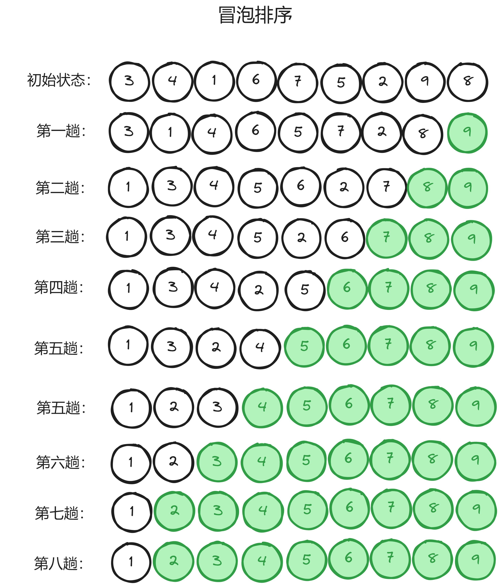
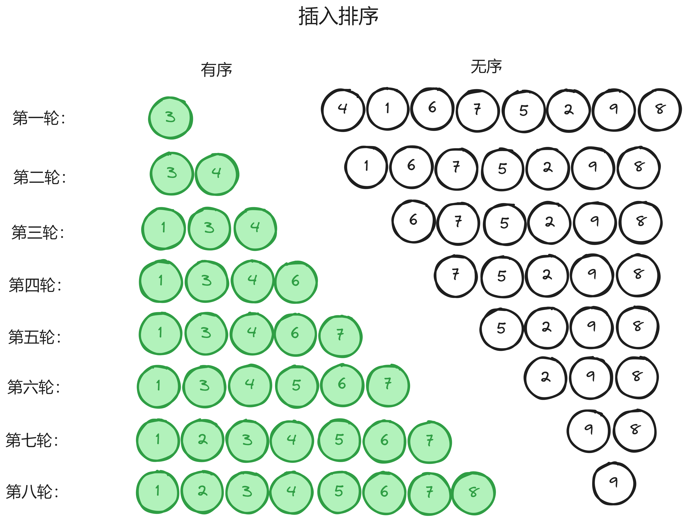
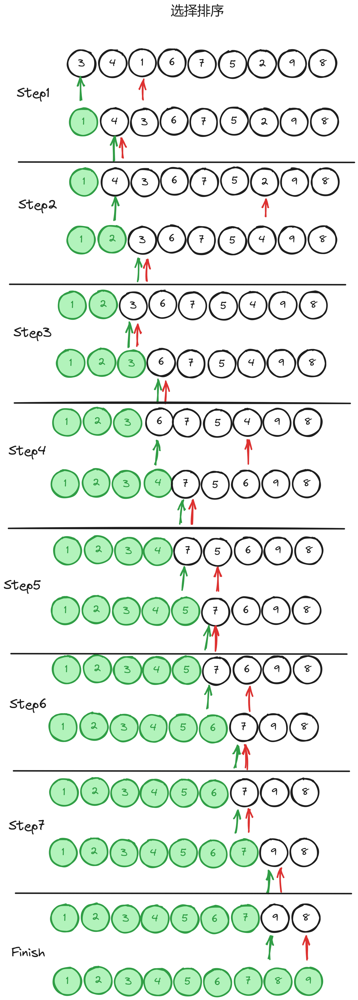

# 排序
## 冒泡排序
冒泡排序是一种简单直观的排序算法，他重复访问要排序的数列，一次比较两个元素，如果他们顺序错误，则需要交换位置，直到数列有序。   
假设$n$为数列长度，他将要重复$n - 1$轮访问比较，每执行完一轮都会数列中将会减少本轮中最大的元素，直到数列只剩一个元素。

    void BubbleSortWithFlag(int arr[], int sz)
    {
        for (int i = 0; i < sz - 1; i++)
        {
            int flag = 0;
            for (int j = 0; j < sz - i - 1; j++)
            {
                if (arr[j] > arr[j + 1])
                {
                    Swap(&arr[j], &arr[j+1]);
                    flag = 1;
                }
            }
            if (!flag)
                break;
        }
    }
上述代码对原始的冒泡排序进行了一个优化——立个flag。每轮比较中，只要顺序不对，flag都会置1，如果flag置0，说明数列已经有序。如图所示，该排序在第六趟已经完成。  
## 插入排序
插入排序是一种最简单直观的排序算法，它的工作原理是通过构建有序序列，对于未排序数据，在已排序序列中从后向前扫描，找到相应位置并插入。   
将第一待排序序列第一个元素看做一个有序序列，把第二个元素到最后一个元素当成是未排序序列。
从头到尾依次扫描未排序序列，将扫描到的每个元素插入有序序列的适当位置。（如果待插入的元素与有序序列中的某个元素相等，则将待插入元素插入到相等元素的后面。）

    void InsertionSort(int arr[], int sz)
    {
        for(int i = 0; i < sz; i++)
        {
            int base = arr[i];
            int j = i - 1;
            while(j >= 0 && arr[j] > base)
            {
                arr[j + 1] = arr[j];
                j--;
            }
            arr[j + 1] = base;
        }
    }
## 选择排序
选择排序是一种简单直观的排序算法，无论什么数据进去都是 O(n²) 的时间复杂度。所以用到它的时候，数据规模越小越好。唯一的好处可能就是不占用额外的内存空间了吧。   
假设$n$为数列长度，他将要重复$n - 1$轮访问比较，每执行完一轮都会数列中将会减少本轮中最小的元素。   

    void SelectionSort(int arr[], int len)
    {
        for(int i = 0; i < len; i++)
        {
            int min = i;
            for(int j = i + 1; j < len; j++)
            {
                if(arr[j] < arr[min])
                    min = j;
            }
            Swap(&arr[min], &arr[i]);
        }
    }

## 快速排序
## 堆排序
## 希尔排序
## 基数排序
## 计数排序
## 归并排序