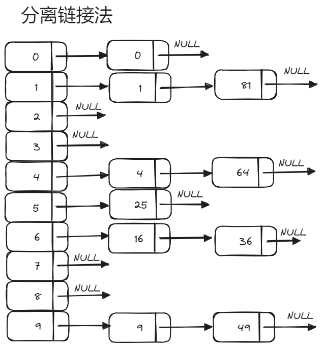

# 散列表（哈希表）
## 散列表的定义
是一种实现键值对之间映射关系的数据结构，通过散列表可以以常数平均时间执行插入、删除和查找。  
## 散列函数 
**模留余数法**   
对于散列表长为TableSize的散列，其散列函数公式为:$$f(key) = key\%TableSize$$   
此方法为最常用的构造散列函数的方法。
    
    int Hash(int key, int tablesize)
    {
        return key % tablesize;
    }
## 分离链接法
即链地址法（拉链法），将散列到同一个值的所有元素保留在一个表中。  
为了方便起见，这些表都将保留哑节点。如果空间紧张，完全可以避免哑节点的存在。   
其诸如*Find、Delete、Insert*等操作都与链表类似。    
  
**相关结构体声明**  

    typedef struct ListNode                 // 链表节点
    {
        int element;                       
        struct ListNode* next;
    }ListNode;

    typedef struct HashTable                // 散列表
    {
        int tablesize;
        ListNode** Arr                      // 可以等效于ListNode* Arr[];
    }HashTable;
**散列表初始化**  

    HashTable* InitializeHashTable(int tablesize)
    {
        HashTable* H = (HashTable*)malloc(sizeof(HashTable));
        H->tablesize = tablesize;
        H->Arr = (ListNode**)malloc(sizeof(ListNode*) * H->tablesize);
        for(int i = 0; i < H->tablesize; i++)             // 创建哑节点
        {
            H->Arr[i] = (ListNode*)malloc(sizeof(ListNode));
            H->Arr[i]->next = NULL;
        }
    }
**插入**

    void Insert(HashTable* H, int element)
    {
        int index = Hash(element, H->tablesize);
        ListNode* POS = Find(H, element);         // 判断要插入的元素是否存在
        if(POS == NULL)                           // 链表表头插入
        {
            ListNode* L =  H->Arr[index];         
            POS = (ListNode*)malloc(sizeof(ListNode));
            POS->next = L->next;
            POS->element = element;
            L->next = POS;
        }
        return POS;
    }
**查找**

    ListNode* Find(HashTable* H, int element)
    {
        int index = Hash(element, H->tablesize);
        ListNode* POS = H->Arr[index]->next;
        while(POS != NULL && POS->element != element)
            POS = POS->next；
        return POS;
    }
**删除**  

    int Delete(HashTable* H, int element)
    {
        int index = Hash(H->tablesize, element);
        ListNode* L = H->arr[index];
        ListNode* p = Find(element, H);
        int val = 0;
        if (p)                              // 如果目标删除节点存在
        {
            ListNode* pre = L;              // 前驱位置
            while (pre->next != p)
                pre = pre->next;
            val = p->element;
            pre->next = p->next;
            if (L->next == p)               // 如果哑节点之后就是目标删除节点
                H->arr[index] = pre;
            free(p);
            return val;
        }
        else
        {
            printf("the element you want to delete is not exist\n");
            return -1;
        }
    }
**展示**  

    void ShowHashTable(HashTable* H)
    {
        for (int i = 0; i < H->tablesize; i++)
        {
            printf(" %d - ", i);                        // 对应序号
            ListNode* current = H->Arr[i]->next;
            while (current != NULL)                     // 元素
            {
                printf("%d -> ", current->element);
                current = current->next;
            }
            printf("NULL \n");
        }
    }
## 开放定址法
该方法的基本思想是如果发生散列冲突，就寻找一个空的单元进行存放元素。  
即第$i$次发生冲突，散列函数公式为：
$$f(key) = key\%TableSize + f(i)$$  
### 线性探测法 
基于上述公式，当发生散列冲突时，以$f(i) = 1, 2, 3, 4,...n$的形式后移。  
即在$key\%Tablesize$的基础上加上$f(i)$。    
**相关结构体声明**  

    typedef struct Element
    {
        int element;                // 内容
        int status;                 // 状态
    }Element;

    typedef struct HashTable
    {
        int tablesize;              // 表的容量
        Element* Arr;               // 结构体数组
    }HashTable;
**初始化**

    HashTable* InitializeHashTable(int tablesize)
    {
        HashTable* H = (HashTable*)malloc(sizeof(HashTable));       
        H->tablesize = tablesize;
        H->Arr = (Element*)malloc(sizeof(Element) * H->tablesize);
        for (int i = 0; i < H->tablesize; i++)      
        // 将所有元素的状态设置为空，内容为-1，代表当前位置可以插入
        {
            H->Arr[i].status = EMPTY;
            H->Arr[i].element = -1;
        }
        return H;
    }
**查找**  

    int Find(HashTable* H, int element)
    {
        int index = Hash(element, H->tablesize);   // 关键字在散列表中的地址
        Element L = H->Arr[index];
        // 线性探测法
        while (H->Arr[index].element != element && H->Arr[index].status != EMPTY)
        {
            index++;
            if(index >= H->tablesize - 1)
                index = 0;
        }
        return index;     // 可能包括两种情况，一种是找到，一种是位置为空可插入
    }
**插入**

    void Insert(HashTable* H, int element)
    {
        int index = Find(H, element);       // 此时，找到散列表中空的位置
        if(H->Arr[index].status == EMPTY)   // 插入值，更新当前位置的状态
        {
            H->Arr[index].status = OCCUPIDE;
            H->Arr[index].element = element;
        }
    }
**删除**

    int Delete(HashTable* H, int element)
    {                               
        int index = Find(H, element);       
        int val = H->Arr[index].element;
        H->Arr[index].element = -1;
        H->Arr[index].status = EMPTY;
        return val;
    }
**展示**

    void ShowHashTable(HashTable* H)
    {
        for (int i = 0; i < H->tablesize; i++)
        {
            printf(" %d --  ", i);
            printf("%d ", H->Arr[i].element);
            printf(" %d \n", H->Arr[i].status);
        }
    }
### 平方探测法  
基于上述公式，当发生散列冲突时，以$f(i) = 1^2, -1^2, 2^2, -2^2,...n^2, -n^2$的形式后移。  
即在$key\%Tablesize$的基础上加上$f(i)$。   
**查找**

    int Find(HashTable* H, int element)
    {
        int index = Hash(element, H->tablesize);
        int offset = 0;
        while (H->Arr[index].element != element && H->Arr[index].status != EMPTY)
        {
            index += 2 * (++offset) - 1;
            if (index >= H->tablesize)
                index -= H->tablesize;
        }
        return index;
}
### 双散列
对于双散列，用两个散列函数进行探测，流行选择$f(i) = i * Hash2(key)$，如果$Hash2(key)$选择不好，将会是灾难性的，其中$Hash2(key) = R - (key\%R)$是一个较为良好的选择。R是小于tablesize的素数。    

    int Hash2(int element, int tablesize)
    {
        return 5 + (element % (tablesize - 5));
    }

    int Find(HashTable* H, int element)
    {
        int index = Hash(element, H->tablesize);
        int offset = Hash2(element, H->tablesize);
        while (H->Arr[index].status != EMPTY && H->Arr[index].element != element)
            index = (index + offset) % H->tablesize;
        return index;
    }
## 再散列
对于使用平方探测法的开放定址散列法，如果表的元素填的太慢，那么操作的运行时间将会开始消耗过长，Insert操作可能会释放，因为没有办法找到合适的位置插入，从而发生太多的移动。此时，需要简历一个大约2倍大小的表，扫描原始的散列表，计算每一个元素的新散列值，并将其插入新的散列表中。*简单理解将表扩容重新映射*。