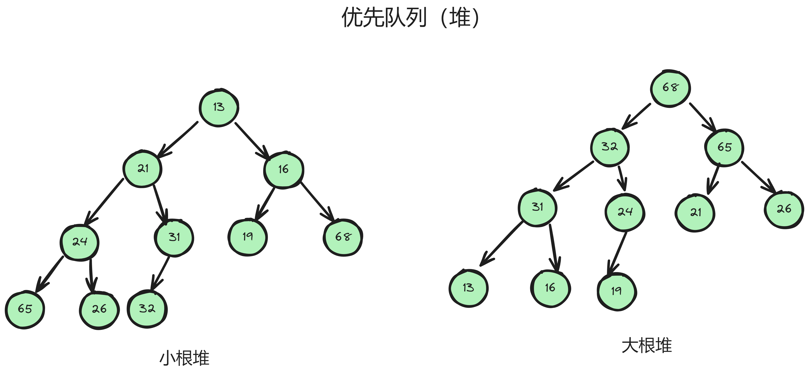
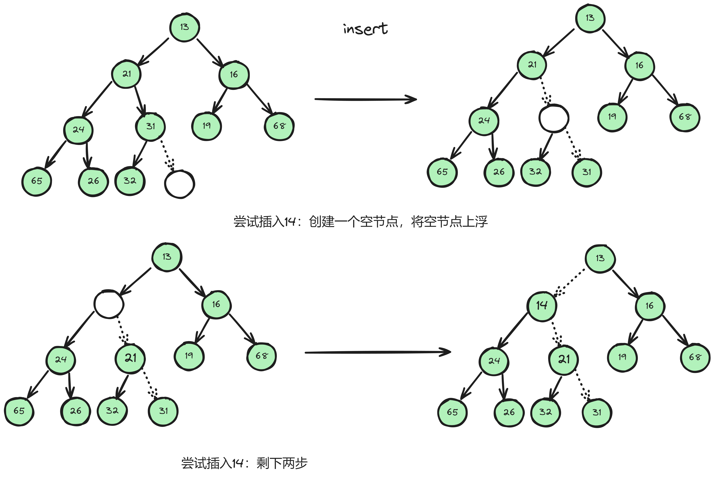
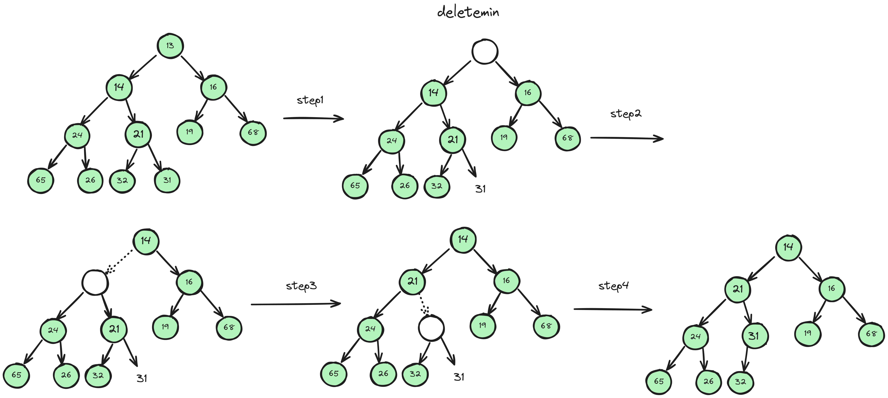

# 优先队列（堆）  
本章为学习优先队列的一个总结，在本章中将用二叉堆（完全二叉树）进行描述优先队列，用数组的形式优先队列并实现基本操作。   
## 优先队列（堆）的性质
优先队列（堆）有两种特性：堆序性和结构性。   
**堆序性**   
这里分两种：大根堆和小根堆。大根堆的父亲点永远大于孩子节点，小根堆的父亲节点永远小于孩子节点。因此我们可以快速找到最小单元或这最大单元。     
**结构性**   
每次堆优先队列（堆）这种数据结构进行操作后，都保持这种结构满足完全二叉树的性质。     
在完全二叉树中，树高位$h$,则这棵树可能有$2^h$到$2^h*2 - 1$个节点。   
## 构建堆和基本堆操作  
**构建堆和初始化**

    typedef struct Heap
    {
        int Capacity;       // 堆的容量
        int Size;           // 元素个数
        int* Arr;           // 数组
    }Heap;

    Heap* Initialize(int MaxCapacity)
    {                       // 构建空堆
        Heap* heap = (Heap*)malloc(sizeof(Heap));
        heap->Arr = (int*)malloc(sizeof(int));
        heap->Capacity = MaxCapacity;
        heap->Size = 0;         
        heap->Arr[0] = -1;  // 把索引位0的位置空出来
        return heap;
    }
**插入**   
为了将一个元素X插入到队中，我们需要在堆中一个符合要求完全二叉树性质的地方进行创建新节点，否则会破环他的结构性。接着将空节点朝着根方向上浮，空节点能够放入元素X。

    void Insert(Heap* H, int element)
    {
        int i = 0;
        for (i = ++H->Size; H->Arr[i >> 1] > element; i >>= 1)
            H->Arr[i] = H->Arr[i >> 1];
        H->Arr[i] = element;    
    }
**删除最小**   
删除一个最小节点时，需要将根节点挖空，函数在执行结束后返回根节点的值，然后不断比较两个孩子节点，往下沉。其函数大致以insert相似，但需要加入判断当前节点的孩子的大小。  

    int DeleteMin(Heap* H)
    {
        int i, child;                                               // 数组中父亲的索引和孩子的索引
        int min = H->Arr[1], last = H->Arr[H->Size--];              // 最小值和最后值
        for ( i = 1; i * 2 <= H->Size; i = child)
        {
            child = i * 2;
            // 这里就是判断左右两个孩子谁大谁小，空节点需要向较小的一边下沉
            if (child != H->Size && H->Arr[child + 1] < H->Arr[child])          
                child++;
            // 判断是不是找到了合适位置，是退出，不是继续下沉
            if (last > H->Arr[child])
                H->Arr[i] = H->Arr[child];
            else
                break;
        }
        H->Arr[child] = last;
        return min;
    }

