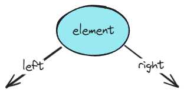
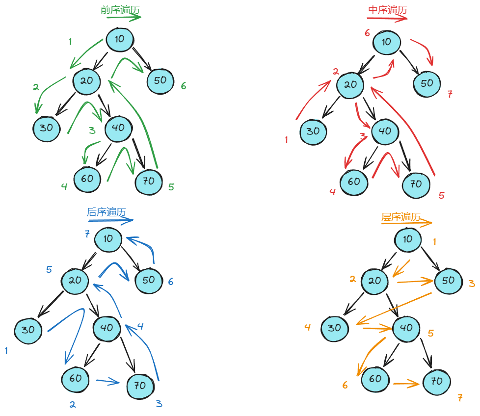
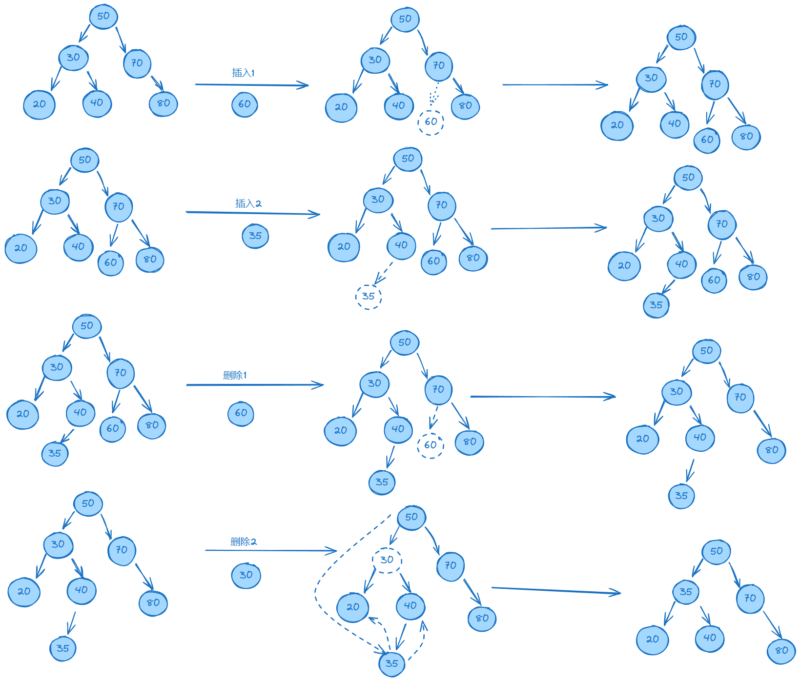
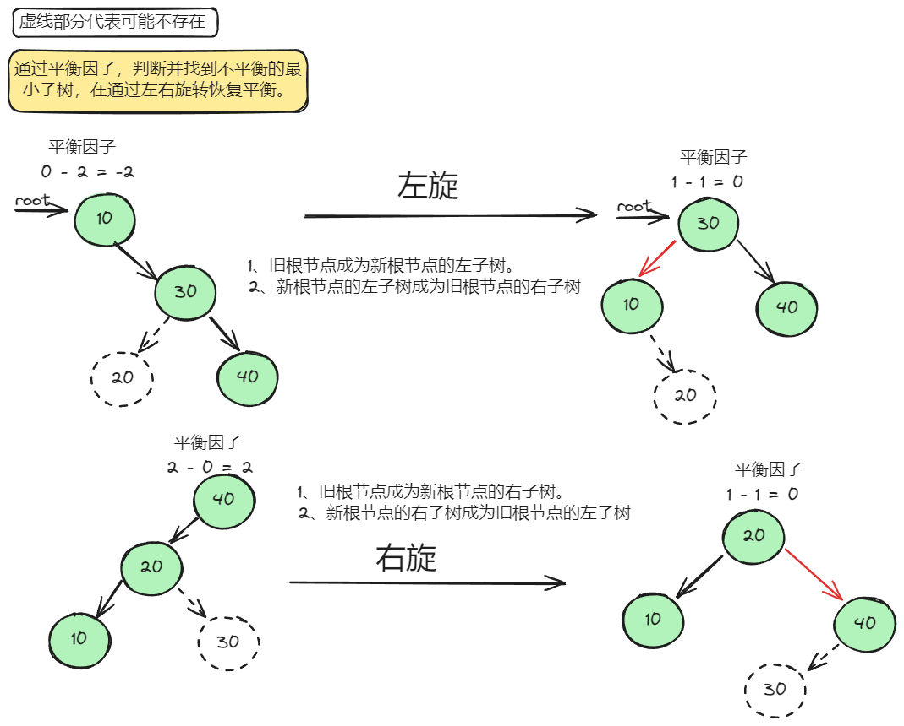
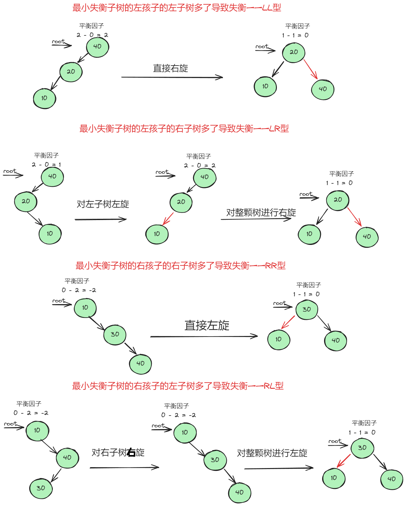
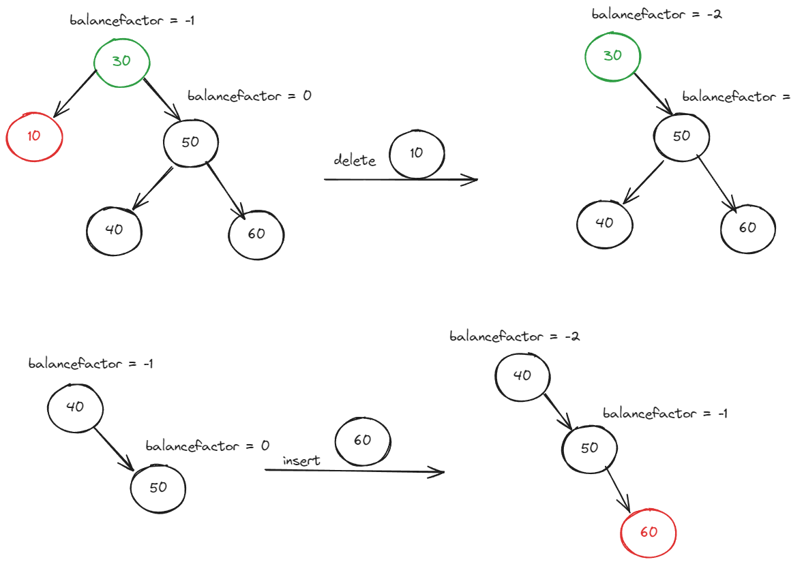

# 树
树是一种非线性数据结构，多用于系统的目录结构等。   
树可以通过递归来定义。     
**树的常见术语**  
|术语|名称|含义|
|:--:|:--:|:-:|
|根节点|root node|位于树的顶点，没有父亲节点|
|叶节点|leaf node|没有孩子节点|
|边|edge|指向孩子的指针|
|层|level|当前节点的层数，根节点为1|
|高度|height|从当前节点到最远的节点的边的数量|
|深度|depth|从根节点到当前节点所经过的边的数量|

## 二叉树
树的一种，其中每个节点的孩子数量不多余两个。   
二叉树的基本单位是节点，每个节点包含值，以及左右孩子等。  

**二叉树节点声明**

    typedef struct Node
    {
        int element;
        int height;
        struct Node* left;
        struct Node* right;
    }Node;
**创建节点**

    Node* CreateNode(int element)
    {
        Node* node = (Node*)malloc(sizeof(Node));
        node->element = element;
        node->height = 1;
        node->left = NULL;
        node->right = NULL;
        return node;
    }

### 二叉树的遍历
二叉树常见的遍历方式包括层序遍历、前序遍历、中序遍历和后序遍历等。  
前中后序遍历体现了一种*先走到尽头，再回溯继续*的思想，即*深度优先搜索(DFS)*。     
层序遍历体现了一种*从头到尾，一圈一圈向外扩展*的思想，即*广度优先搜索(BFS)*，常借用队列实现。  
**前序遍历**   
 
    void PreOrder(Node* node)
    {   // 先访问根节点，再访问左孩子节点，最后访问右孩子节点
        if (node == NULL)
            return;
        printf("%d ", node->element);
        PreOrder(node->left);
        PreOrder(node->right);
    }

**中序遍历**  

    void InOrder(Node* node)
    {   // 先访问左孩子节点，再访问根节点，最后访问右孩子节点。
        if (node == NULL)
            return;
        InOrder(node->left);
        printf("%d ", node->element);
        InOrder(node->right);
    }

**后续遍历** 

    void PostOrder(Node* node)
    {   // 先访问左孩子节点，再访问右孩子节点，最后访问根节点。
        if (node == NULL)
            return;
        PostOrder(node->left);
        PostOrder(node->right);
        printf("%d ", node->element);
    }

**层序遍历**  

    void LevelOrder(BTN* node)
    {
        if (node == NULL)
            return;
        TQ* tq = CreateTQ();            // 创建队列
        push(tq, node);                 // 将第一个节点入队
        while (tq->next != NULL)        // 队列不为空，
        {
            BTN* current = pop(tq);     // 出队
            printf("%d ", current->element);
            if (current->left != NULL)  // 如果当前出队元素有孩子，孩子入队
                push(tq, current->left);
            if (current->right != NULL)
                push(tq, current->right);
        }
    }

### 二叉搜索树（二叉查找树，二叉排序树）
性质：对于每个节点，其左孩子的值小于当前节点的值，右孩子的值大于当前节点的值。  
由于树是递归创建的，所以树的相关操作例程也是由递归完成编写得到。  
**查找**
这个操作一般需要返回指向二叉树中具有关键字节点的指针。   

    Node* Find(Node* node, int target)
    {
        if(node == NULL)
            return NULL;
        if(target < node->element)          // 如果目标值比当前值小，往左找
            return Find(node->left, target);
        else if(target > node->element)     // 如果目标值比当前值大，往右找
            return Find(node->right, target);
        else                                // 找到，返回当前节点
            return node;
    }
**查找最大和最小**

    Node* FindMax(Node* node)
    {
        if (node == NULL) 
            return NULL;
        else if (node->right == NULL)
            return node;
        else
            return FindMax(node->right);
    }

    Node* FindMin(Node* node)
    {
        if (node == NULL) 
            return NULL;
        else if (node->left == NULL)
            return node;
        else
            return FindMin(node->left);
    }
**插入**  
这个操作类似于查找，需要找适当位置进行插入。

    Node* Insert(Node* node, int element)
    {
        if(node == NULL)                       // 节点为空，创建节点
            return CreateNode(element);
        
        if(node->element > element)            // 插入值比当前值小，往左找
            node->left = Insert(node->left, element);
        else if(node->element < element)       // 插入值比当前值大，往右找
            node->right = Insert(node->right, element);
        else                                   // 不允许重复插入
            return node;
    }
**删除**  
删除操作相较于其他操作会稍微复杂些。  
第一种:要删除的节点*只有一个没有孩子*，可以将其父亲节点指向他的孩子(如果有孩子的话)。  
第二种:要删除的节点*有两个孩子*，需要将当前节点的右孩子中最小的孩子代替当前节点，并递归删除。

    Node* Delete(Node* node, int target)
    {
        if(node == NULL)                       // 如果节点为空，返回
            return node;
        
        if(node->element > target)             // 删除值比当前值大，往右找
            node->left = Delete(node->left, target);
        else if(node->element < target)        // 删除值比当前值小，往右找   
            node->right = Delete(node->right, target);
        else                                   // 找到了 
        {
            Node* temp;
            if(node->left && node->right)      // 删除节点有两个孩子
            {
                temp = FindMin(root->right);    // 找到右孩子中最小的孩子
                node->element = temp->element;  // 代替
                node->right = Delete(node->right, element); // 递归删除
            }
            else
            {
                temp = node;              // 删除节点有一个孩子或者没有孩子
                if(node->left == NULL)
                    node = node->right;
                else if(node->right == NULL)
                    node = node->left;
                free(temp);
            }
            return node;
        }
    }

### 平衡二叉树
带有平衡条件的二叉查找树，即每个节点的左孩子和右孩子的**高度**差不超过1。  
**获取高度**

    int GetHeight(Node* node)
    {
        if(node == NULL)
            return 0;
        return root->height;
    }
判断一个二叉搜索树是否平衡，需要通过**平衡因子**判断。  
**平衡因子**

    int GetBalanceFactor(Node* node)
    {
        if(node == NULL)
            return 0;
        return GetHeight(node->left) - GetHeight(node->right);
    }

基于二叉搜索树的插入和删除，每次改动都需要将这棵树保持平衡，通过**旋转**完成。     
**左旋**  
旋转步骤  
    1.旧根节点为新根节点的左子树  
    2.新根节点的左子树(如果存在)为旧根节点的右子树  
    3.更新树高

    Node* LeftRotate(Node* node)
    {
        Node* newnode = node->right;
        Node* t = newnode->left;

        newnode->left = node;
        node->right = t;

        node->height = Max(GetHeight(node->left), GetHeight(node->right)) + 1;
        newnode->height = Max(GetHeight(newnode->left), GetHeight(newnode->right)) + 1;

        return newnode;
    }
**右旋**  
旋转步骤  
    1.旧根节点为新根节点的右子树  
    2.新根节点的右子树(如果存在)为旧根节点的左子树  
    3.更新树高

    Node* RightRotate(Node* node)
    {
        Node* newnode = node->left;
        Node* t = newnode->right;

        newnode->right = node;
        node->left = t;

        node->height = Max(GetHeight(node->left), GetHeight(node->right)) + 1;
        newnode->height = Max(GetHeight(newnode->left), GetHeight(newnode->right)) + 1;

        return newnode;
    }
  
**需要旋转的情况**  
当平衡因子的绝对值大于等于2时，就需要进行旋转。     
**旋转哪颗树**      
有这么一种情况，插入了一个结点，导致一个子树不平衡了，导致整个二叉树也不平衡了，该转子树还是整个树？  
肯定是先转发生不平衡的最小的那个子树，那个子树转好了，说不定整个树就不用转了。  
当然还有一种情况，就是子树不平衡，但是整个树是平衡的，这样不用说，只用转子树就行了。   
所以，综上，我们要转的就是发生不平衡的最小的那个二叉树。当最小的不平衡二叉树转平衡了，如果还不平衡，再找下一个最小不平衡的二叉树进行修改。  
**失衡情况**  
在左孩子的左子树多了结点后导致失衡 LL型  
在左孩子的右子树多了结点后导致失衡 LR型  
在右孩子的左子树多了结点后导致失衡 RL型  
在右孩子的右子树多了结点后导致失衡 RR型     
  
**插入**  
基于二叉搜索树的插入基础上，对每个插入的节点都需要及时将整个树调整为平衡状态。

    Node* InsertNode(Node* node, int element)
    {   // 二叉搜索树基础插入操作
        if(node == NULL)
            return CreateNode(element);
        
        if(node->element > element)
            node->left = InsertNode(node->left, element);
        else if(node->elelment < elelment)
            node->right = InsertNode(node->right, element)l
        else
            return node;
        // 获取平衡因子
        int balancefactor = GetBalanceFactor(node);
        // 四种失衡条件
        if(balancefactor > 1 && GetBalanceFactor(node->left) > 0)
            return RightRotate(node); 
        if(balancefactor > 1 && GetBalanceFactor(node->left) < 0)
        {
            node->left = LeftRotate(node->left);
            return RightRotate(node);
        }
        if(balancefactor < -1 && GetBalanceFactor(node->right) < 0)
            return LeftRotate(node);
        if(balancefactor < -1 && GetBalanceFactor(node->right) < 0)
        {
            node->right = RightRotate(node->right);
            return LeftRotate(node);
        }
        return node;
    }

**删除**     
基于二叉搜索树的删除基础上，对每个插入的节点都需要及时将整个树调整为平衡状态。
    
    Node* DeleteNode(Node* node, int element)
    {
        if(node == NULL)                     
            return node;
        if(node->element > target)             
            node->left = Delete(node->left, target);
        else if(node->element < target)        
            node->right = Delete(node->right, target);
        else                                   
        {
            Node* temp;
            if(node->left && node->right)      
            {
                temp = FindMin(root->right);    
                node->element = temp->element;  
                node->right = Delete(node->right, element);
            }
            else
            {
                temp = node;              
                if(node->left == NULL)
                    node = node->right;
                else if(node->right == NULL)
                    node = node->left;
                free(temp);
            }
            return node;
        }
        // 获取平衡因子
        int balancefactor = GetBalanceFactor(node);
        // 四种失衡条件
        if(balancefactor > 1 && GetBalanceFactor(node->left) >= 0)
            return RightRotate(node); 
        if(balancefactor > 1 && GetBalanceFactor(node->left) < 0)
        {
            node->left = LeftRotate(node->left);
            return RightRotate(node);
        }
        if(balancefactor < -1 && GetBalanceFactor(node->right) <= 0)
            return LeftRotate(node);
        if(balancefactor < -1 && GetBalanceFactor(node->right) < 0)
        {
            node->right = RightRotate(node->right);
            return LeftRotate(node);
        }
        return node;
    }
**插入和删除区别**
  
左边是一个平衡二叉树，当我们删除了10以后，是需要进行旋转的。但是，30的右子树还是平衡的，也就是$balancefactor = 0$ 平衡因子为0，但是这个时候也是应该去做右旋的。  
所以，要加上等于号。  
再来看插入结点，是不会出现这种情况的。  
左边是个平衡二叉树，我们再插入一个就变成了不平衡的了。当插入60这个结点，就要调整了，不平衡发生的时候，40的右子树的平衡因子，一定不可能为0的。为1的时候就已经要进行平衡调整了。  
所以，不能加等于号（但是加上=代码也能正常运行,就是不符合我们遇到最小不平衡子树就调整这个原则了）。  
这就是二者的区别。

### 伸展树

## B树