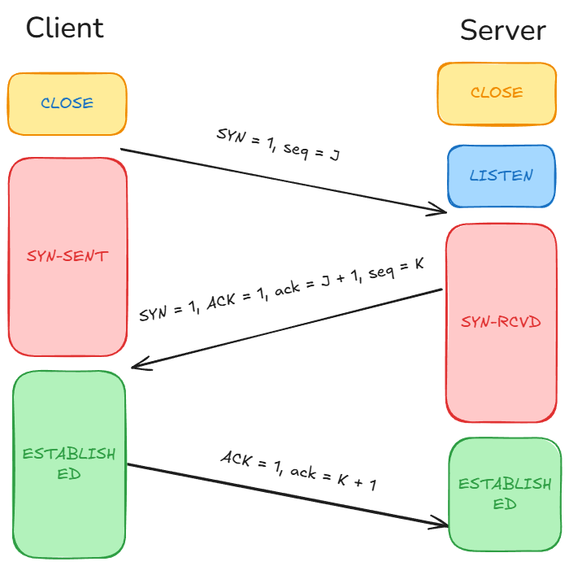
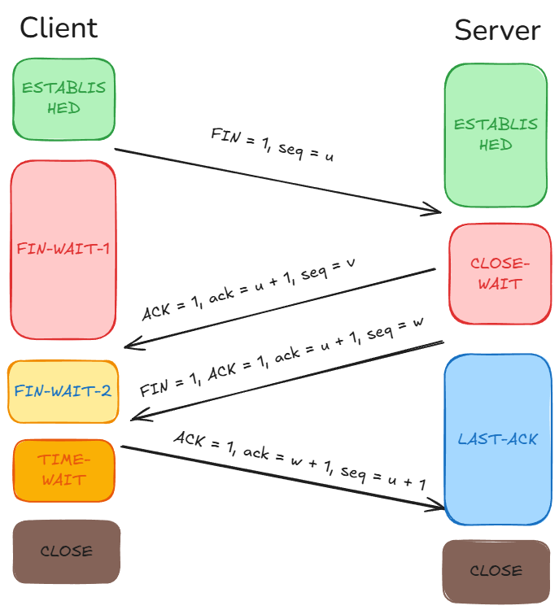

# 网络
### OSI七层模型与TCP/IP五层模型
|OSI七层模型|TCP/IP概念层模型|功能|TCP/IP协议族|
|----------|---------------|----|-----------|
|应用层|应用层|文件传输，电子邮件，文件服务，虚拟终端|TFTP, HTTP, SNMP, FTP, SMTP, DNS, Telnet|
|表示层|.|数据格式化，代码转换，数据加密|.|
|会话层|.|解除或简历别的节点的联系|.|
|传输层|传输层|提供端对端的接口|TCP, UDP|
|网络层|网络层|为数据包选择路由|IP, ICMP, RIF, OSTP, BGP, IGMP|
|数据链路层|链路层|传输有地址的帧以及错误检测功能|SLIP, CSLIP, PPP, ARP, RARP, MTU|
|物理层|.|以二进制数据形式再物理媒体上传输数据|IS02110, IEEE802, IEEE802.2|
### 三次握手与四次挥手
#### 三次握手（建立TCP连接）

1. 第一次握手
    - 客户端将SYN置1，随机产生一个值seq = j, 并将该数据包发给服务端，客户端进入SYN_SENT状态，等待服务端确认
    - **第一次握手是为了确认客户端发送数据没有问题**
2. 第二次握手
    - 服务端收到数据包后由标志位SYN = 1确定客户端请求建立连接，服务端将标志位SYN和ACK都置1，ack = j + 1，随机产生一个值seq = k, 并将数据包发给客户端确认连接请求，服务端进入SYN_RCVD状态
    - **第二次握手是为了确认服务端接收和发送数据没有问题**
3. 第三次握手
    - 客户端收到服务端发来的报文后，会再向服务端发送报文，其中包含标志位ACK = 1， 序列号seq = j + 1, 确认号ack = k + 1。第三次握手前客户端的状态为SYN-SENT， 第三次握手后客户端和服务端的状态都为ESTABLISHED，此时连接建立完成
    - **第三次握手是为了确认通信双方已成功建立连接**
#### 四次挥手（终止TCP连接）

1. 第一次挥手
    - 客户端发送一个FIN，用来关闭客户端到服务端的数据传送，客户端进入FIN-WAIT-1状态
2. 第二次挥手
    - 服务端收到FIN后，发送一个ACK给客户端，确认序号为收到序号+1，服务端进入CLOSE_WAIT状态
3. 第三次挥手
    - 服务端发送一个FIN，用来关闭服务端到客户端的数据传送，服务端进入LAST_ACK状态
4. 第四次挥手
    - 客户端收到FIN后，客户端进入TIME_WAIT状态，接着发送一个ACK给服务端，确认序号为收到序号+1， 服务端进入CLOSE状态完成四次挥手
### TCP和UDP

|特性	|TCP	|UDP|
|-------|-------|----|
|是否连接	|面向连接（需三次握手）	|无连接|
|可靠性|	提供可靠传输（确认机制、重传、排序）|	不保证可靠性|
|数据传输顺序|	按序传输|	数据可能无序到达|
|速度|	较慢（需额外控制机制）|	较快|
|头部开销|	大（20字节或以上）|	小（8字节）|
|应用场景|	文件传输、网页浏览、数据库通信等|	视频直播、在线游戏、DNS等|
|应用层协议|FTP, Telnet, SMTP, POP3, HTTP|DNS, SNMP, TFTP|
### HTTP和HTTPS
