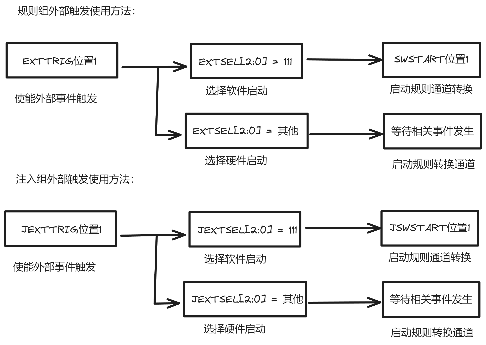

# ADC
## ADC 简介
ADC，Analog-to-Digital Converter，模数转换器     

|特性参数|含义|
|:-----:|:--:|
|分辨率|表示ADC能辨别的最小模拟量，用二进制位数表示|
|转换时间|表示完成一次A/D转换所需要的时间，转换时间越短，采样率越高|
|精度|最小刻度基础上叠加的各种误差的参数，精度手ADC性能、温度和气压影响|
|量化误差|用数字量近似表示模拟量，采用四舍五入原则，此过程产生的误差为量化误差|          
## ADC工作原理 
### ADC框图 
框图可以大致分为一下几个部分：  
1. 参考电压/模拟部分电压  
2. 输入通道  
3. 转换序列   
4. 触发源   
5. 转换时间   
6. 数据寄存器   
7. 中断   

**F1系列**     
    
**F4系列**  

### 参考电压/模拟部分电压   
**ADC供电电源**：$V_{\text{SSA}}$>、$V_{\text{DDA}}$ $(2.4 \, \text{V} \leq V_{\text{DDA}} \leq 3.6 \, \text{V})$   
**ADC输入电压范围**：$V_{\text{REF-}} \leq V_{\text{IN}} \leq V_{\text{REF+}}$ 即$0 \, \text{V} \leq V_{\text{IN}} \leq 3.3 \, \text{V}$      
***输入检测电压一定要在这个范围，否则会烧坏芯片***   
### 输入通道   
### 转换序列
A/D转换被组织为两组：*规则组（常规转换组）*和*注入组（注入转换组）*   

**规则序列寄存器**

  

从$SQ1\sim16$，每一个寄存器位域都可以设置对应的通道$0 \sim 17$，最后需要在$SQL$写入规则序列要转换的通道数（ps: 个人理解位设置转换的优先级）     
**注入序列寄存器**  

同规则序列寄存器，但是注入序列只用到一个寄存器，因为只有4个转换通道。这里需要注意的是填写对应的通道需要从高位写起，最后一段英文有说明
### 触发源
触发转换的方法有两种：
1. ADON位触发转换（仅F1）   
当ADC_CR2寄存器的ADON位为1时（表示ADC已经上电），单独给ADON位写1（启动规则组转换）   
2. 外部事件触发转换  
外部事件触发转换又可以分为规则组触发和注入组触发      

**F1使用方法**

**F4使用方法**  

### 转换时间
1. 设置ADC时钟

2. 设置ADC转换时间   
F1ADC转换时间公式：$T_{\text{CONV}} = 采样时间 + 12.5个周期$      
F4ADC转换时间公式(分辨率为12)：$T_{\text{CONV}} = 采样时间 + 12个周期$    
采样时间可以通过SMPx[2:0]设置， x=0~17    
**F1采样时间**
  
**F4采样时间**
   
### 数据寄存器   
**F1**  

**F4**   
   
### 中断   
|中断事件|事件表示|使能控制位|
|:-----:|:------:|:-------:|
|**规则通道转换结束**|EOC|EOCIE|
|**注入通道转换结束**|JEOC|JEOCIE|
|**设置模拟看门狗状态位**|AWD|AWDIE|
|**溢出**|OVR|OVRIE|   
  
**DMA请求（只适用于规则组）**   
规则组每个通道转换结束后，除了可以产生中断外，还可以产生DMA请求，可以利用DMA及时把转好的数据传输到指定内存里，放置数据被覆盖    
### 单次转换模式和连续转换模式    
|CONT位|0|1|
|:----:|:-:|:-:|
|**转换组/转换模式**|**单词转换模式只触发一次转换**）|**连续转换模式（自动触发下一次转换**）|
|**规则组**|转换结果存储在ADC_DR EOC(转换结束)标志位被置1  如果设置了EOCIE位，则产生中断然后ADC停止|转换结果存储在ADC_DR EOC(转换结束)标志位被置1  如果设置了EOCIE位，则产生中断|
|**注入组**|转换结果存储在ADC_DR JEOC(转换结束)标志位被置1  如果设置了JEOCIE位，则产生中断然后ADC停止|转换结果存储在ADC_DRJx JEOC(转换结束)标志位被置1  如果设置了JEOCIE位，则产生中断 自动注入：将JAUTO位置1|  
### 扫描模式   
|关闭扫描模式（SCAN位置0）|使用扫描模式（SCAN位置1）|
|:---------:|:---------:|
|ADC只转换ADC_SQRx或ADC_JSQR选中的第一个通道进行转换|ADC会扫描所有被ADC_SQRx或ADC_JSQR选中的所有通道|   

**不同模式组合作用** 
||||  
|:-----:|:------:|:----:|
|单次转换不扫描|只转换一个通道，而且是一次，需要等待下一次触发|使用ADC单通道，并要求进行一次转换|  
|单次转换扫描|ADC_SQRx或ADC_JSQR选中的所有通道都转换一次|使用ADC多通道，并要求所有通道转换一次就停止|  
|连续转换不扫描|只转换一个通道，转换完之后自动指定下一次转换|使用ADC单通道，并要求对该通道连续转换|  
|连续转换扫描|ADC_SQRx或ADC_JSQR选中的所有通道都转换一次，并自动进入下一次轮换|使用ADC多通道，并要求所有通道转换完成后，自动启动下一次轮换|     
## ADC相关HAL库
|函数或宏|主要寄存器|主要功能|
|:------|:--------|:-------|
|**HAL_StatusTypeDef HAL_ADC_Init(ADC_HandleTypeDef\* hadc);**|CR1、CR2|配置ADC的工作参数|
|**HAL_StatusTypeDef HAL_ADCEx_Calibration_Start(ADC_HandleTypeDef\* hadc);**;|CR2|ADC校准|
|**void              HAL_ADC_MspInit(ADC_HandleTypeDef\* hadc);**|无|存放NVIC、CLOCK、GPIO初始化代码|
|**HAL_StatusTypeDef HAL_RCCEx_PeriphCLKConfig(RCC_PeriphCLKInitTypeDef\* PeriphClkInit);**|RCC_CFGR|设置扩展外设时钟，如ADC、RTC等|
|**HAL_StatusTypeDef HAL_ADC_ConfigChannel(ADC_HandleTypeDef\* hadc, ADC_ChannelConfTypeDef\* sConfig);**|SQRx、SMPRx|配置ADC相应通道的相关参数|
|**HAL_StatusTypeDef HAL_ADC_Start(ADC_HandleTypeDef\* hadc);**|CR2|启动A/D转换|
|**HAL_StatusTypeDef HAL_ADC_PollForConversion(ADC_HandleTypeDef\* hadc, uint32_t Timeout);**|SR|等待规则通道转换完成|
|**uint32_t          HAL_ADC_GetValue(ADC_HandleTypeDef\* hadc);**|DR|获取规则通道A/D转换结果|
|**HAL_StatusTypeDef HAL_ADC_Start_DMA(ADC_HandleTypeDef* hadc, uint32_t* pData, uint32_t Length);**|||
||||   

***ADC_HandleTypeDef***    
该结构体为ADC的句柄，具体内容如下

    typedef struct __ADC_HandleTypeDef
    {
        ADC_TypeDef *Instance;              /* ADC寄存器基地址 */
        ADC_InitTypeDef Init;                   /* ADC参数初始化结构体变量 */
        DMA_HandleTypeDef *DMA_Handle;            /* DMA配置结构体 */
        HAL_LockTypeDef Lock;                   /*!< ADC locking object */

        __IO uint32_t State;                  /*!< ADC communication state (bitmap of ADC states) */

        __IO uint32_t ErrorCode;              /*!< ADC Error code */

        #if (USE_HAL_ADC_REGISTER_CALLBACKS == 1)
        void (* ConvCpltCallback)(struct __ADC_HandleTypeDef *hadc);              /*!< ADC conversion complete callback */
        void (* ConvHalfCpltCallback)(struct __ADC_HandleTypeDef *hadc);          /*!< ADC conversion DMA half-transfer callback */
        void (* LevelOutOfWindowCallback)(struct __ADC_HandleTypeDef *hadc);      /*!< ADC analog watchdog 1 callback */
        void (* ErrorCallback)(struct __ADC_HandleTypeDef *hadc);                 /*!< ADC error callback */
        void (* InjectedConvCpltCallback)(struct __ADC_HandleTypeDef *hadc);      /*!< ADC group injected conversion complete callback */       /*!< ADC end of sampling callback */
        void (* MspInitCallback)(struct __ADC_HandleTypeDef *hadc);               /*!< ADC Msp Init callback */
        void (* MspDeInitCallback)(struct __ADC_HandleTypeDef *hadc);             /*!< ADC Msp DeInit callback */
        #endif /* USE_HAL_ADC_REGISTER_CALLBACKS */ 
    }ADC_HandleTypeDef;
***ADC_InitTypeDef***  
该结构体是用于配置ADC初始化参数用的，具体内容如下   

    typedef struct
    {
        uint32_t DataAlign;                         /* 设置数据的对齐方式 */
        uint32_t ScanConvMode;                      /* 扫描模式 */
        FunctionalState ContinuousConvMode;         /* 单次转换模式或连续转换模式 */
        uint32_t NbrOfConversion;                   /* 设置转换通道数目 */
        FunctionalState  DiscontinuousConvMode;     /* 间断模式 */
        uint32_t NbrOfDiscConversion;               /* 间断模式的规则通道个数 */
        uint32_t ExternalTrigConv;                  /* ADC外部触发源选择 */
    }ADC_InitTypeDef;
***ADC_ChannelConfTypeDef***   
该结构体是用于通道配置，具体内容如下
  
    typedef struct 
    {
        uint32_t Channel;           /* 转换通道 */
        uint32_t Rank;              /* 转换顺序 */
        uint32_t SamplingTime;      /* 采样时间 */
    }ADC_ChannelConfTypeDef;