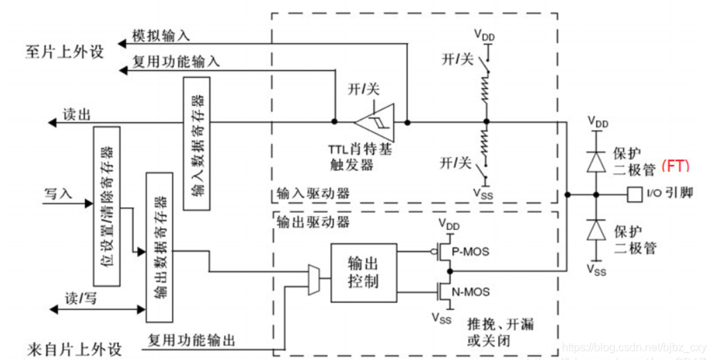
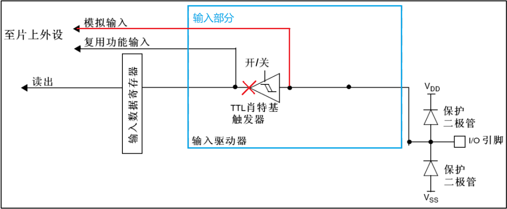

# GPIO
## GPIO简介
通用输入输出接口（General Purpose Input Output）。按组分配，每组16个IO口组数视芯片而定。   
通俗讲：GPIO就是用来控制或者采集外部器件信息的外设，一般通过原理图找到目标IO口，并为之配置状态。  
## GPIO原理图
  
GPIO由输入数据寄存器(IDR)、输出数据寄存器(ODR)、位设置/清除寄存器(BSRR)、TTL肖特基触发器、保护二极管、双MOS管和上下拉电阻组成。  

| 器件名 | 作用 |  
|:------:|:---:|    
|保护二极管|用于保护引脚外部过高或过低的电压输入|
|TTL肖特基触发器|由肖特基管组成的施密特触发器，用于将模拟信号变成矩阵信号，便于读取|
|双MOS管|控制GPIO的推挽输出、开漏输出两种模式|

## GPIO八种工作原理
| GPIO-MODE(HAL) | 模式 |
|:------:|:---:| 
|GPIO_MODE_ANALOG|模拟功能|
|GPIO_MODE_INPUT|浮空输入|
|需要在GPIO_InitTypeDef设置上拉|输入上拉|
|需要在GPIO_InitTypeDef设置下拉|输入下拉|
|GPIO_MODE_OUTPUT_OD|开漏输出|
|GPIO_MODE_OUTPUT_PP|推挽输出|
|GPIO_MODE_AF_OD|复用开漏输出|
|GPIO_MODE_AF_PP|复用推挽输出|
### 模拟功能

上、下拉电阻关闭，TTL肖特基触发器关闭，双MOS管不导通。  
专门用于模拟信号的输入输出。
### 输入浮空

上、下拉电阻关闭，TTL肖特基触发器打开，双MOS管不导通。  
空闲时，IO状态不确定，由外部环境决定。  
一般把这种模式用于标准的通信协议如I2C、USART的接收端。
### 输入上拉

上拉电阻打开，下拉电阻关闭，TTL肖特基触发器打开，双MOS不导通，进入IDR。  
在I/O端口悬空(在无信号输入)的情况下，输入端的电平可以保持在高电平。  
在I/O端口输入为低电平的时候，输入端的电平则为低电平。
### 输入下拉

上拉电阻关闭，下拉电阻打开，TTL肖特基触发器打开，双MOS不导通，进入IDR。  
在I/O端口悬空(在无信号输入)的情况下，输入端的电平可以保持在低电平。  
在I/O端口输入为高电平的时候，输入端的电平则为高电平。
### 开漏输出

上、下拉电阻关闭，TTL肖特基触发器打开，P-MOS管一直不导通。  
往ODR对应位写0，经过“输出控制”取反操作后，输出1到N-MOS管的栅极，此时N-MOS管导通，输出低电平。  
往ODR对应位写1，经过“输出控制”取反操作后，输出0到N-MOS管的栅极，此时N-MOS管不导通，IO 引脚呈现高阻态，即不输出低电平，也不输出高电平。 若要使IO引脚输出高电平就必须接上拉电阻。  
### 推挽输出  

上、下拉电阻关闭，TTL肖特基触发器打开，双MOS管导通。   
往ODR写0，经过“输出控制”取反操作后，输出1到P-MOS管的栅极，这时P-MOS管不导通，同时也会输出1到N-MOS管的栅极，这时N-MOS管导通，使得IO引脚接到 VSS，即输出低电平。  
往ODR写1，经过“输出控制”取反操作后，输出0到N-MOS管的栅极，这时N-MOS管不导通，同时也会输出1到P-MOS管的栅极，这时P-MOS管导通，使得IO引脚接到 VDD，即输出高电平。
### 复用开漏输出和复用推挽输出 

对于相应的复用模式，则是根据GPIO的复用功能来选择的。
## GPIO相关代码
### GPIO_InitTypeDef 类型的结构体变量

    typedef struct
    {
        uint32_t Pin; /* 引脚号 */
        uint32_t Mode; /* 模式设置 */
        uint32_t Pull; /* 上拉下拉设置 */
        uint32_t Speed; /* 速度设置 */
    } GPIO_InitTypeDef;
#### 成员 Pin 
表示引脚号，范围：GPIO_PIN_0 到 GPIO_PIN_15。
#### 成员 Mode
表示GPIO的选择模式。

    #define GPIO_MODE_INPUT (0x00000000U) /* 输入模式 */
    #define GPIO_MODE_OUTPUT_PP (0x00000001U) /* 推挽输出 */
    #define GPIO_MODE_OUTPUT_OD (0x00000011U) /* 开漏输出 */
    #define GPIO_MODE_AF_PP (0x00000002U) /* 复用推挽 */
    #define GPIO_MODE_AF_OD (0x00000012U) /* 复用开漏 */
    #define GPIO_MODE_AF_INPUT GPIO_MODE_INPUT
    #define GPIO_MODE_ANALOG (0x00000003U) /* 模拟模式 */

    #define GPIO_MODE_IT_RISING (0x10110000u) /* 外部中断，上升沿触发检测 */
    #define GPIO_MODE_IT_FALLING (0x10210000u) /* 外部中断，下降沿触发检测 */
    #define GPIO_MODE_IT_RISING_FALLING (0x10310000u) /* 外部中断，上升和下降双沿触发检测 */
    
    #define GPIO_MODE_EVT_RISING (0x10120000U) /*外部事件，上升沿触发检测 */
    #define GPIO_MODE_EVT_FALLING (0x10220000U) /*外部事件，下降沿触发检测 */
    
    #define GPIO_MODE_EVT_RISING_FALLING (0x10320000U) /* 外部事件，上升和下降双沿触发检测 */

#### 成员Pull
用于设置上、下拉电阻。

    #define GPIO_NOPULL (0x00000000U) /* 无上下拉 */
    #define GPIO_PULLUP (0x00000001U) /* 上拉 */
    #define GPIO_PULLDOWN (0x00000002U) /* 下拉 */
#### 成员Speed
用于设置GPIO的速度。

    #define GPIO_SPEED_FREQ_LOW (0x00000002U) /* 低速 */
    #define GPIO_SPEED_FREQ_MEDIUM (0x00000001U) /* 中速 */
    #define GPIO_SPEED_FREQ_HIGH (0x00000003U) /* 高速 */
### GPIO相关函数原型
    void HAL_GPIO_Init(GPIO_TypeDef *GPIOx, GPIO_InitTypeDef *GPIO_Init); /* GPIO初始化 */
    void HAL_GPIO_DeInit(GPIO_TypeDef *GPIOx, uint32_t GPIO_Pin); /* GPIO反初始化 */
    GPIO_PinState HAL_GPIO_ReadPin(GPIO_TypeDef *GPIOx, uint16_t GPIO_Pin); /* GPIO的读引脚函数 */
    void HAL_GPIO_WritePin(GPIO_TypeDef *GPIOx, uint16_t GPIO_Pin, GPIO_PinState PinState); /* GPIO的写引脚函数 */
    void HAL_GPIO_TogglePin(GPIO_TypeDef *GPIOx, uint16_t GPIO_Pin); /* GPIO的翻转电平函数 */
    HAL_StatusTypeDef HAL_GPIO_LockPin(GPIO_TypeDef *GPIOx, uint16_t GPIO_Pin);
    void HAL_GPIO_EXTI_IRQHandler(uint16_t GPIO_Pin);
    void HAL_GPIO_EXTI_Callback(uint16_t GPIO_Pin);

### GPIO时钟使能 
    __HAL_RCC_GPIOx_CLK_ENABLE();