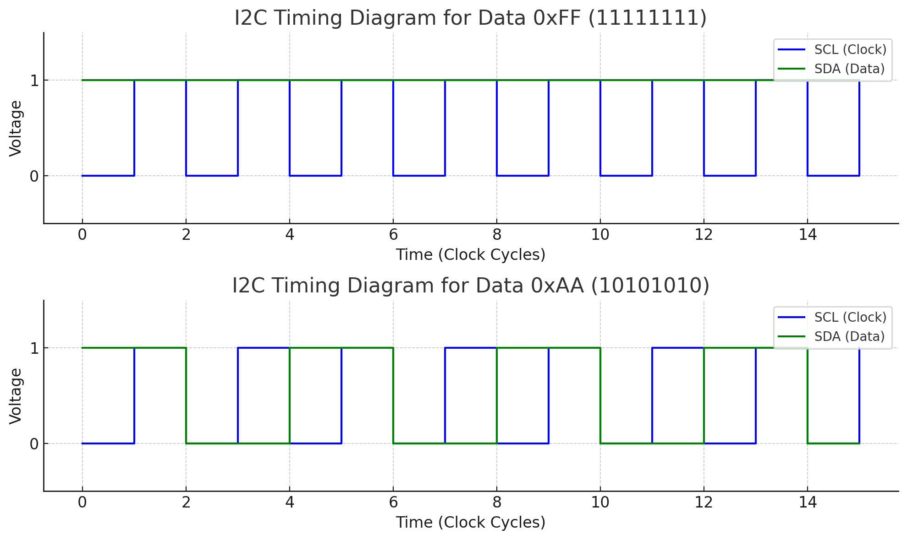

# IIC
IIC：Inter Integrated Circuit, 集成电路总线, 是一个同步串行半双工通信总线
## IIC总线结构图

1. 由时钟线SCL和数据线SDA组成，并且接上拉电阻，确保总线空闲状态为高电平 
2. 总线支持多设备连接，允许多主机存在，每个设备都有一个唯一的地址  
3. 连接到总线上的数目受总线的最大电容400pf限制  
4. 数据传输速率：标准模式100k bit/s 快速模式400k bit/s 高速模式3.4M bit/s
## IIC协议 

### 软件IIC伪代码  
**一些宏定义**

    #define iic_write_cmd   0
    #define iic_read_cmd    1
    #define iic_error       1
    #define iic_ok          0
**起始信号**

    // SCL为高电平期间，SDA从高电平往低电平跳变
    void iic_start(void)
    {
        IIC_SDA(1);
        IIC_SCL(1);
        
        iic_delay();

        IIC_SDA(0);
        iic_delay();
        IIC_SCL(0);
        iic_delay();    // 制住总线，准备发送/接受数据
    }
**停止信号**

    // SCL为高电平期间，SDA从低电平往高电平跳变
    void iic_stop(void)
    {
        IIC_SDA(0);
        iic_delay();
        IIC_SCL(1);
        iic_delay();
        IIC_SDA(1);     // 发送总线停止信号
        iic_delay();
    }
**检测应答信号**

    uint8_t iic_wait_ack(void)
    {
        IIC_SDA(1);     // 主机释放SDA线
        iic_delay();
        IIC_SCL(1);     // 从机返回ACK
        iic_delay();
        if(IIC_READ_SDA)    // SCL高电平读取SDA状态
        {
            iic_stop();     // SDA高电平表示从机nack
            return 1;
        }
        IIC_SCL(0);     // SCL低电平表示结束ACK检查
        return 0;
    }
**发送应答信号**

    void iic_ack(void)
    {
        IIC_SCL(0);
        iic_delay();
        IIC_SDA(0);     // 数据线为低电平表示应答
        iic_delay();
        IIC_SCL(1);
        iic_delay();
    }
**发送非应答信号**

    void iic_nack(void)
    {
        IIC_SCL(0);
        iic_delay();
        IIC_SDA(1);     // 数据线为高电平表示非应答
        iic_delay();
        IIC_SCL(1);
        iic_delay();
    }
**发送1B数据**

    void iic_send_byte(uint8_t data)
    {
        for(uint8_t t = 0; t < 8; t++>)
        {
            IIC_SDA((data&0x80)>>7);    // 先获取最高位，再将其他位清零
            iic_delay(); 
            IIC_SCL(1);
            iic_delay(); 
            IIC_SCL(0);
            data<<=1;                   // 用于下一次发送
        }
        IIC_SDA(1);                     // 发送完成，主机释放SDA线 
    }
**接收1B数据**

    uint8_t iic_read_byte(uint8_t ack)
    {
        uint8_t receive = 0;
        for(uint8_t t = 0; t < 8; t++)
        {
            receive <<= 1;              // 将高位左移，方便后续存放数据      
            IIC_SCL(1);
            iic_delay(); 
            if(IIC_READ_SDA) receive++;
            IIC_SCL(0);
            iic_delay(); 
        }
        if(!ack) iic_nack();
        else iic_ack();
        return receive;
    }
    
**举个读写的例子，如图**
1. 当数据为0x11111111时，SDA将一直处于高电平状态。
2. 当数据为0x10101010时，SDA将会在高低电平来回跳变循环八次   

当SCL从低电平跳到高电平时，表示数据正在被读取，当SCL从高电平跳到低电平时，表示可以进行下一位数据的准备     

**向寄存器写入数据**

    uint8_t iic_write_reg(uint8_t len, uint8_t reg, uint8_t buf[])
    {
        uint8_t buf_index;
        uint8_t ret;

        iic_start();                                        // 开始信号
        iic_send_byte(addr << 1 | iic_write_cmd);           // 发送器件地址
        iic_wait_ack();                     
        iic_send_byte((reg >> 8) & 0xff);                   // 发送寄存器高八位地址
        iic_wait_ack();
        iic_send_byte(reg & 0xff);                          // 发送寄存器低八位地址

        for (buf_index = 0; buf_index < len; buf_index++)   // 发送要写入的数据    
        {
            iic_send_byte(buf[buf_index]);              
            ret = iic_wait_ack();
            if(ret != 0)
            {
                break;
            } 
        }
        iic_stop();                                         // 停止信号
        if(ret != 0)                                        // 返回写入情况
        {
            return iic_error;
        }
        return iic_ok
    }

**向寄存器读取数据**

    void iic_read_reg(uint8_t len, uint8_t reg, uint8_t buf[])
    {
        uint8_t buf_index;

        iic_start();                                        // 开始信号
        iic_send_byte(addr << 1 | iic_write_cmd);           // 发送器件地址 | 写命令
        iic_wait_ack();                     
        iic_send_byte((reg >> 8) & 0xff);                   // 发送寄存器高八位地址
        iic_wait_ack();
        iic_send_byte(reg & 0xff);                          // 发送寄存器低八位地址
        iic_start();                                        // 开始信号
        iic_send_byte(addr << 1 | iic_read_cmd);            // 发送器件地址 | 读命令
        iic_wait_ack();  

        for(buf_index = 0; buf_index < len - 1, buf_index++)// 获取数据
        {
            buf[buf_index] = iic_read_byte(1);
        }
        buf[buf_index] = iic_read_byte(0);                  // 最后一个字不需要应答信号

        iic_stop();
    }
**注意**   
在I2C协议中，地址传输是7位或10位的，而总线上传输的每一个字节实际上是8位。为了区分是读操作还是写操作，I2C协议规定将第8位（最低位，即LSB位）作为读/写位。
1. 写操作：如果最低位是 0，表示主机要向从设备写入数据。
2. 读操作：如果最低位是 1，表示主机要从从设备读取数据。    

因此，I2C设备地址是7位，而总线上需要发送8位数据。为了给最后一位（读/写位）腾出空间，需要将7位地址左移1位，然后在最后一位添加读/写位。

### 软件IIC配置步骤
1. 使能SCL和SDA对应时钟      
    __HAL_RCC_GPIOx_CLK_ENABLED()  
2. 设置GPIO的工作模式   
    SDA开漏/SCL推挽输出模式，使用HAL_GPIO_Init()初始化  
3. 编写解本信号   
    start、stop、wait_ack、send ack、send nack、wait ack 
4. 编写读和写函数
    iic_read_byte、iic_send_byte、iic_write_reg、iic_read_reg

**IIC总线SDA建议用开漏模式的原因**   
**输出时**：mcu输出0, 可以拉低信号，实现低电平发送，主机输出1（实际不起作用，可以回顾GPIO模式相关笔记），有外部上拉电阻实现高电平发送。   
**输入时**：mcu设置输出1状态，此时mcu无法输出1，相当于释放了SDA数据线，此时外部器件可以主动拉低SDA引脚/释放SDA线（同样由上拉电阻提供输出1的功能），实现SDA脚的高低电平变化   
### 硬件IIC
在STM32 HAL库中，**HAL_I2C_Mem_Read、HAL_I2C_Mem_Write、HAL_I2C_Master_Receive 和 HAL_I2C_Master_Transmit** 这几个函数用于 I2C 通信中的不同场景。它们分别用于从带有寄存器/内存结构的从设备中读取和写入数据，以及直接从从设备中读取和写入数据。

#### 1. HAL_I2C_Mem_Read vs HAL_I2C_Master_Receive
**HAL_I2C_Mem_Read**    
用途：从带有内存结构或寄存器的从设备中读取数据。    
操作流程：
1. 主机发送从设备地址，写操作。
2. 主机发送从设备的寄存器或内存地址。
3. 主机发送重复起始信号，发送从设备地址，读操作。
4. 主机从指定寄存器读取数据。      

典型场景：读取 EEPROM、传感器寄存器等数据。

    示例：
    HAL_I2C_Mem_Read(&hi2c1, 0x50 << 1, 0x10, I2C_MEMADD_SIZE_8BIT, pData, 10, 1000);
**HAL_I2C_Master_Receive**    
用途：从从设备中直接读取数据，而不需要指定寄存器或内存地址。    
操作流程：    
1. 主机发送从设备地址，读操作。
2. 主机接收从设备数据。   

典型场景：直接从传感器或设备读取当前状态或数据，不涉及寄存器。     

    示例：
    HAL_I2C_Master_Receive(&hi2c1, 0x50 << 1, pData, 10, 1000);
区别：
1. **HAL_I2C_Mem_Read** 需要先发送寄存器/内存地址，适合从带有内存结构的设备读取数据。
2. **HAL_I2C_Master_Receive** 直接从设备读取，不涉及寄存器地址，适合简单的设备读取数据。
#### HAL_I2C_Mem_Write vs HAL_I2C_Master_Transmit
**HAL_I2C_Mem_Write**    
用途：向带有内存结构或寄存器的从设备中写入数据。  
操作流程：   
1. 主机发送从设备地址，写操作。
2. 主机发送寄存器/内存地址。
3. 主机发送数据，写入指定寄存器。

典型场景：向 EEPROM、传感器等设备的寄存器写入数据。    

    示例：
    HAL_I2C_Mem_Write(&hi2c1, 0x50 << 1, 0x10, I2C_MEMADD_SIZE_8BIT, pData, 10, 1000);
**HAL_I2C_Master_Transmit**    
用途：直接向从设备发送数据，而不涉及寄存器/内存地址。    
操作流程：    
1. 主机发送从设备地址，写操作。
2. 主机直接发送数据。

典型场景：直接向从设备发送数据，如控制命令或简单的数据块。
    
    示例：
    HAL_I2C_Master_Transmit(&hi2c1, 0x50 << 1, pData, 10, 1000);
区别：
1. **HAL_I2C_Mem_Write** 需要先指定寄存器/内存地址，适合带有寄存器的设备。
2. **HAL_I2C_Master_Transmit** 直接向设备发送数据，不涉及寄存器地址，适合无需地址的简单通信。