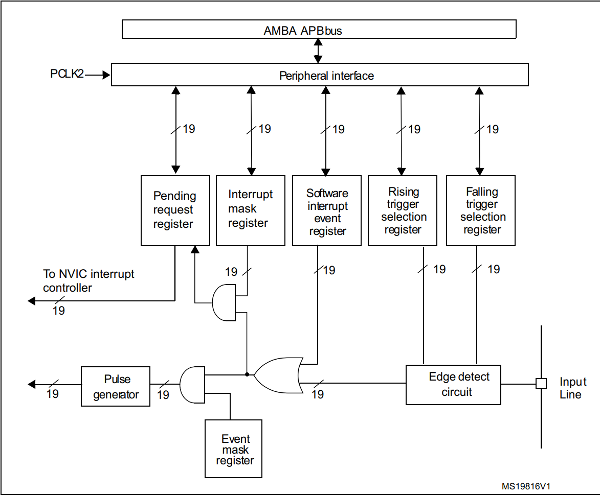
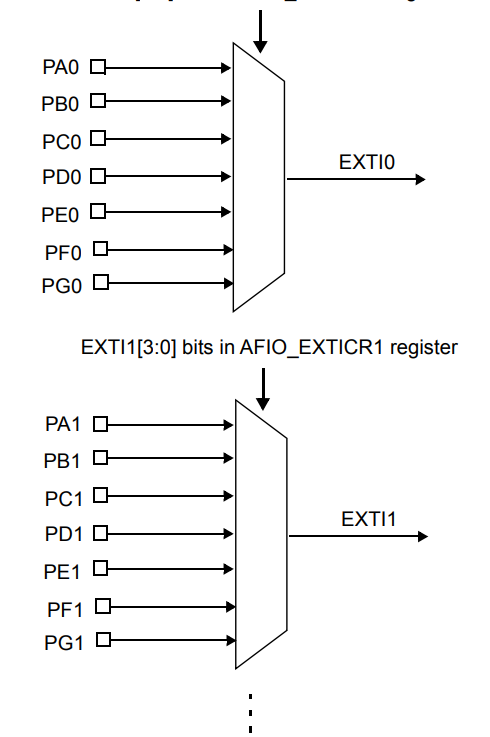

# 中断
打断CPU执行正常的程序，转而处理紧急程序，然后返回原暂停的程序继续运行。  
## 中断的作用和意义
1.实时控制：在确定时间内对相应事件做出响应；  
2.故障处理：检测到故障，需要第一时间进行处理；  
3.数据传输：不确定数据何时会来；  
高效处理紧急程序，不会占用CPU资源   
## 中断基本知识
Cortex-M3内核支持256个中断，其中包含16个系统中断和240个外部中断。    
STM32只有84个中断，其中包括16个系统中断和68个可屏蔽中断。  
# NVIC
嵌套向量中断控制器(Nested vectored interrupt controller)  
中断向量表参考STM32芯片参考手册。
## NVIC寄存器
NVIC相关寄存器定义。

    typedef struct
    {
    __IOM uint32_t ISER[8U];               /*!< Offset: 0x000 (R/W)  Interrupt Set Enable Register */
            uint32_t RESERVED0[24U];
    __IOM uint32_t ICER[8U];               /*!< Offset: 0x080 (R/W)  Interrupt Clear Enable Register */
            uint32_t RSERVED1[24U];
    __IOM uint32_t ISPR[8U];               /*!< Offset: 0x100 (R/W)  Interrupt Set Pending Register */
            uint32_t RESERVED2[24U];
    __IOM uint32_t ICPR[8U];               /*!< Offset: 0x180 (R/W)  Interrupt Clear Pending Register */
            uint32_t RESERVED3[24U];
    __IOM uint32_t IABR[8U];               /*!< Offset: 0x200 (R/W)  Interrupt Active bit Register */
            uint32_t RESERVED4[56U];
    __IOM uint8_t  IP[240U];               /*!< Offset: 0x300 (R/W)  Interrupt Priority Register (8Bit wide) */
            uint32_t RESERVED5[644U];
    __OM  uint32_t STIR;                   /*!< Offset: 0xE00 ( /W)  Software Trigger Interrupt Register */
    }  NVIC_Type;
**ISER[8]**，中断使能寄存器，Cortex-M3内核支持256个中断，8个32寄存器控制，每个位控制一个中断。  
**ICER[8]**，中断除能寄存器，与**ISER**相反，用来清除某个中断的使能。  
**ISPR[8]**，中断使能挂起控制寄存器，可以将正在进行的中断挂起，而执行同级或者更高级别的中断。    
**ICPR[8]**，中断解挂控制寄存器，与**ISPR**相反，用来将挂起的中断解挂。  
**IABR[8]**，中断激活标志位寄存器，这是一个只读寄存器，用来读取中断状态，当中断执行完之后自动挂0。  
**IP[240]**，中断优先级控制寄存器。
## 中断优先级
***STM32***的中断优先级可以分为：*抢占优先级*和*响应优先级(子优先级)*。  
**抢占优先级**：抢占优先级高的可以打断正在执行的抢占优先级低的中断。  
**响应优先级**：抢占优先级相同时，响应优先级高的中断不能打断抢占优先级高的中断。  
**当抢占优先级和响应优先级相同时，遵行自然优先级，数值越小，优先级越高**。  
数值越小，表示优先级越。  
对于NVIC的中断优先级分组，由**AIRCR**寄存器的[10:8]位在定义优先级分组，由**IPR**寄存器分配优先级。
|优先级分组|AIRCR[10:8]|IPRx bit[7:4]分配|分配结果|
|:-------:|:---------:|:---------------:|:-----:|
|0|111|0: 4|0位抢占优先级，4位响应优先级|
|1|110|1：3|1位抢占优先级，3位响应优先级|
|2|101|2: 2|2位抢占优先级，2位响应优先级|
|3|100|3: 1|3位抢占优先级，1位响应优先级|
|4|011|4: 0|4位抢占优先级，0位响应优先级|
每一个工程只设置意识优先级分组
## NVIC相关函数
***HAL_NVIC_SetPriorityGrouping***，该函数用于设置中断优先级分组。
        
    void HAL_NVIC_SetPriorityGrouping(uint32_t PriorityGroup);
形参是中断优先级分组号，有五组。

    #define NVIC_PRIORITYGROUP_0         0x00000007U 
    #define NVIC_PRIORITYGROUP_1         0x00000006U 
    #define NVIC_PRIORITYGROUP_2         0x00000005U 
    #define NVIC_PRIORITYGROUP_3         0x00000004U 
    #define NVIC_PRIORITYGROUP_4         0x00000003U 
***HAL_NVIC_SetPriority***，该函数用于设置中断的抢占优先级和响应优先级。

    void HAL_NVIC_SetPriority(IRQn_Type IRQn, uint32_t PreemptPriority,uint32_t SubPriority);
    
形参1是中断号，可以选择范围。

    typedef enum
    {
        /******  Cortex-M3 Processor Exceptions Numbers ***************************************************/
        NonMaskableInt_IRQn         = -14,    /*!< 2 Non Maskable Interrupt                             */
        HardFault_IRQn              = -13,    /*!< 3 Cortex-M3 Hard Fault Interrupt                     */
        MemoryManagement_IRQn       = -12,    /*!< 4 Cortex-M3 Memory Management Interrupt              */
        BusFault_IRQn               = -11,    /*!< 5 Cortex-M3 Bus Fault Interrupt                      */
        UsageFault_IRQn             = -10,    /*!< 6 Cortex-M3 Usage Fault Interrupt                    */
        SVCall_IRQn                 = -5,     /*!< 11 Cortex-M3 SV Call Interrupt                       */
        DebugMonitor_IRQn           = -4,     /*!< 12 Cortex-M3 Debug Monitor Interrupt                 */
        PendSV_IRQn                 = -2,     /*!< 14 Cortex-M3 Pend SV Interrupt                       */
        SysTick_IRQn                = -1,     /*!< 15 Cortex-M3 System Tick Interrupt                   */

        /******  STM32 specific Interrupt Numbers *********************************************************/
        WWDG_IRQn                   = 0,      /*!< Window WatchDog Interrupt                            */
        PVD_IRQn                    = 1,      /*!< PVD through EXTI Line detection Interrupt            */
        TAMPER_IRQn                 = 2,      /*!< Tamper Interrupt                                     */
        RTC_IRQn                    = 3,      /*!< RTC global Interrupt                                 */
        FLASH_IRQn                  = 4,      /*!< FLASH global Interrupt                               */
        RCC_IRQn                    = 5,      /*!< RCC global Interrupt                                 */
        EXTI0_IRQn                  = 6,      /*!< EXTI Line0 Interrupt                                 */
        EXTI1_IRQn                  = 7,      /*!< EXTI Line1 Interrupt                                 */
        EXTI2_IRQn                  = 8,      /*!< EXTI Line2 Interrupt                                 */
        EXTI3_IRQn                  = 9,      /*!< EXTI Line3 Interrupt                                 */
        EXTI4_IRQn                  = 10,     /*!< EXTI Line4 Interrupt                                 */
        DMA1_Channel1_IRQn          = 11,     /*!< DMA1 Channel 1 global Interrupt                      */
        DMA1_Channel2_IRQn          = 12,     /*!< DMA1 Channel 2 global Interrupt                      */
        DMA1_Channel3_IRQn          = 13,     /*!< DMA1 Channel 3 global Interrupt                      */
        DMA1_Channel4_IRQn          = 14,     /*!< DMA1 Channel 4 global Interrupt                      */
        DMA1_Channel5_IRQn          = 15,     /*!< DMA1 Channel 5 global Interrupt                      */
        DMA1_Channel6_IRQn          = 16,     /*!< DMA1 Channel 6 global Interrupt                      */
        DMA1_Channel7_IRQn          = 17,     /*!< DMA1 Channel 7 global Interrupt                      */
        ADC1_2_IRQn                 = 18,     /*!< ADC1 and ADC2 global Interrupt                       */
        USB_HP_CAN1_TX_IRQn         = 19,     /*!< USB Device High Priority or CAN1 TX Interrupts       */
        USB_LP_CAN1_RX0_IRQn        = 20,     /*!< USB Device Low Priority or CAN1 RX0 Interrupts       */
        CAN1_RX1_IRQn               = 21,     /*!< CAN1 RX1 Interrupt                                   */
        CAN1_SCE_IRQn               = 22,     /*!< CAN1 SCE Interrupt                                   */
        EXTI9_5_IRQn                = 23,     /*!< External Line[9:5] Interrupts                        */
        TIM1_BRK_IRQn               = 24,     /*!< TIM1 Break Interrupt                                 */
        TIM1_UP_IRQn                = 25,     /*!< TIM1 Update Interrupt                                */
        TIM1_TRG_COM_IRQn           = 26,     /*!< TIM1 Trigger and Commutation Interrupt               */
        TIM1_CC_IRQn                = 27,     /*!< TIM1 Capture Compare Interrupt                       */
        TIM2_IRQn                   = 28,     /*!< TIM2 global Interrupt                                */
        TIM3_IRQn                   = 29,     /*!< TIM3 global Interrupt                                */
        TIM4_IRQn                   = 30,     /*!< TIM4 global Interrupt                                */
        I2C1_EV_IRQn                = 31,     /*!< I2C1 Event Interrupt                                 */
        I2C1_ER_IRQn                = 32,     /*!< I2C1 Error Interrupt                                 */
        I2C2_EV_IRQn                = 33,     /*!< I2C2 Event Interrupt                                 */
        I2C2_ER_IRQn                = 34,     /*!< I2C2 Error Interrupt                                 */
        SPI1_IRQn                   = 35,     /*!< SPI1 global Interrupt                                */
        SPI2_IRQn                   = 36,     /*!< SPI2 global Interrupt                                */
        USART1_IRQn                 = 37,     /*!< USART1 global Interrupt                              */
        USART2_IRQn                 = 38,     /*!< USART2 global Interrupt                              */
        USART3_IRQn                 = 39,     /*!< USART3 global Interrupt                              */
        EXTI15_10_IRQn              = 40,     /*!< External Line[15:10] Interrupts                      */
        RTC_Alarm_IRQn              = 41,     /*!< RTC Alarm through EXTI Line Interrupt                */
        USBWakeUp_IRQn              = 42,     /*!< USB Device WakeUp from suspend through EXTI Line Interrupt */
        TIM8_BRK_IRQn               = 43,     /*!< TIM8 Break Interrupt                                 */
        TIM8_UP_IRQn                = 44,     /*!< TIM8 Update Interrupt                                */
        TIM8_TRG_COM_IRQn           = 45,     /*!< TIM8 Trigger and Commutation Interrupt               */
        TIM8_CC_IRQn                = 46,     /*!< TIM8 Capture Compare Interrupt                       */
        ADC3_IRQn                   = 47,     /*!< ADC3 global Interrupt                                */
        FSMC_IRQn                   = 48,     /*!< FSMC global Interrupt                                */
        SDIO_IRQn                   = 49,     /*!< SDIO global Interrupt                                */
        TIM5_IRQn                   = 50,     /*!< TIM5 global Interrupt                                */
        SPI3_IRQn                   = 51,     /*!< SPI3 global Interrupt                                */
        UART4_IRQn                  = 52,     /*!< UART4 global Interrupt                               */
        UART5_IRQn                  = 53,     /*!< UART5 global Interrupt                               */
        TIM6_IRQn                   = 54,     /*!< TIM6 global Interrupt                                */
        TIM7_IRQn                   = 55,     /*!< TIM7 global Interrupt                                */
        DMA2_Channel1_IRQn          = 56,     /*!< DMA2 Channel 1 global Interrupt                      */
        DMA2_Channel2_IRQn          = 57,     /*!< DMA2 Channel 2 global Interrupt                      */
        DMA2_Channel3_IRQn          = 58,     /*!< DMA2 Channel 3 global Interrupt                      */
        DMA2_Channel4_5_IRQn        = 59,     /*!< DMA2 Channel 4 and Channel 5 global Interrupt        */
    } IRQn_Type;
形参2是抢占优先级，可选0~15。  
形参3是响应优先级，可选0~15。   
***HAL_NVIC_EnableIRQ***，该函数用于中断使能。

    void HAL_NVIC_EnableIRQ(IRQn_Type IRQn);    
***HAL_NVIC_DisableIRQ***，该函数用于中断除能。  

    void HAL_NVIC_DisableIRQ(IRQn_Type IRQn);    
***HAL_NVIC_SystemReset***,该函数用于系统复位。

    void HAL_NVIC_SystemReset(void);
# EXTI
外部中断和事件控制器，由20个产生事件/中断请求的边沿检测器组成，即20条EXTI线。  
**中断**：需要进入NVIC，有相应的中断服务函数，需要CPU处理；  
**事件**：不需要进入NVIC， 仅用内部硬件自动控制，TIM，DMA，ADC等；  
|EXIT线|功能说明|
|:----:|:------:|
|0~15|对应GPIO引脚|
|16|PVD输出|
|17|RTC闹钟事件|
|18|USB唤醒事件|
|19|连接到以太网唤醒事件|
|...|...|

每条EXTI线都可以单独配置：  
选择类型：中断/事件；  
触发方式：上升沿/下降沿/双边沿触发；    
支持软件触发；   
开启/屏蔽；   
挂起状态位。 
## EXTI工作原理
   
***边缘检测电路(Edge detect circuit)***：上升沿触发选择寄存器(RTSR)和下降沿触发选择寄存器(FTSR)。边缘检测电路以输入线(Input Line)作为信号输入端。通过边沿检测遇到有效信号**1**，就输出至或门电路，若是**0**则无效边缘检测的标准取决于FTSR和RTSR的设定。  
***或门电路***：或门电路的信号来源于边缘检测电路和软件中断事件寄存器(SWIER)。或门电路只要输入端信号有**1**，就会输出**1**至与门电路1。   
***与门电路1***：与门电路1的信号来源于或门电路和事件屏蔽寄存器(EMR),可以简单控制EMR来实现是否产生事件的目的。与门电路输出有效信号**1**至脉冲发生器产生脉冲信号供其他外设使用。   
***与门电路2***：输入端信号分别来源于中断屏蔽寄存器(IMR)和请求挂起寄存器(PR)，当IMR和PR对应位置1时，与门电路才会将有效信号**1**输出至NVIC中断控制器。   
*产生中断线路目的使把输入信号输入到NVIC，进一步运行中断服务函数，实现功能。*
## EXTI线与IO映射关系
   
**对应关系**：Px0~EXTI0...Px15~EXTI15。   
改映射关系实在寄存器AFIO——EXTICRn配置的，配置前需要使能时钟。  
## EXTI外部中断配置步骤
|步骤|对应函数代码|
|:--:|:---------:|
|使能对应的GPIO口时钟|__HAL_RCC_GPIO_CLK_ENABLE|   
|设置GPIO的工作模式，触发条件，开启AFIO时钟，设置IO口与中断线的映射关系|HAL_GPIO_Init|  
|设置中断分组|HAL_NVIC_SeTpriorityGrouping|
|设置中断优先级|HAL_NVIC_SetPriority|  
|使能中断|HAL_NVIC_EnableIRQ|  
|设计中断服务函数|EXTIx_IRQHandler|  
|清除中断标志|__HAL_GPIO_EXTI_CLEAR_IT|
|编写中断服务回调函数|HAL_GPIO_EXTI_Callback|