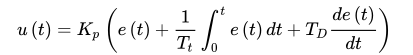

# PID 控制算法
## PID 控制算法介绍
PID是Proportional(比例)、Integral(积分)、Differential(微分)的首字母缩写； 是一种结合比例、积分和微分三种环节于一体的闭环控制算法，它是目前为止在连续控制系统中计数最为成熟的一种控制算法。
## PID 控制算法公式

<li>Kp——比例增益，Kp与比例度成倒数关系 </li>
<li>Tt——积分时间常数 </li>
<li>TD——微分时间常数 </li>
<li>TD——微分时间常数 </li>
<li>e(t)——给定值r(t)与测量值误差</li>

### 比例(P)
比例控制是最简单的一种控制方式，成比例的反应控制系统钟输入与输出的偏差信号，只要偏差一旦产生，就会立即产生控制的作用来减小产生的误差。   
比例控制器的输出与输入成正比的关系，能够迅速的反应偏差，**偏差减小的速度取决于比例系数Kp**。
1. Kp越大偏差减小的就越快，但是极易引起震荡；
2. Kp减小发生震荡的可能性减小，但是调节的速度变慢；
3. 单纯的比例控制存在不能消除的静态误差，
这里就需要积分来控制。   
### 积分(I)
在积分环节中，主要消除由比例控制产生的静态误差，以提高系统的无差度。**积分作用的强弱，取决于积分时间常数Ti**，Ti越大积分作用越弱，反之则越强。积分控制作用的存在与偏差e(t)的存在时间有关，只要系统存在着偏差，积分环节就会不断起作用，对输入偏差进行积分， 使控制器的输出及执行器的开度不断变化，产生控制作用以减小偏差。在积分时间足够的情况下，可以完全消除静差，这时积分控制作用将维持不变。Ti越小，积分速度越快，积分作用越强。**积分作用太强会使系统超调加大，甚至使系统出现振荡。**   
### 微分(D)
微分环节的作用是反应系统偏差的一个变化趋势，也可以说是变化率。  
可以在误差来临之前提前引入一个有效的修正信号，有利于提高输出响应的快速性，减小被控量的超调和增加系统的稳定性，虽然积分环节可以消除静态误差但是降低了系统的响应速度，所以引入微分控制器就显得很有必要，尤其是具有较大惯性的被控对象使用PI控制器很难得到很好的动态调节品质，系统会产生较大的超调和振荡，这时可以引入微分作用。  
在偏差刚出现或变化的瞬间，不仅根据偏差量作出及时反应(即比例控制作用)，还可以根据偏差量的变化趋势(速度)提前给出较大的控制作用(即微分控制作用)，将偏差消灭在萌芽状态，这样可以大大减小系统的动态偏差和调节时间，使系统的动态调节品质得以改善。   
微分环节有助于系统减小超调，克服振荡， 加快系统的响应速度，减小调节时间，从而改善了系统的动态性能，但微分时间常数过大，会使系统出现不稳定。    
微分控制作用一个很大的缺陷是容易引入高频噪声，所有在干扰信号比较严重的流量控制系统中不宜引入微分控制作用。  
## PID控制算法的离散化
   
PID控制其实就是对偏差的控制过程；   
<li>如果偏差为0,则比例环节不起作用，只有存在偏差时，比例环节才起作用；</li>   
<li> 积分环节主要是用来消除静差，所谓静差，就是系统稳定后输出值和设定值之间的差值，积分环节实际上就是偏差累计的过程，把累计的误差加到原有系统上以抵消系统造成的静差；</li>
<li>而微分信号则反应了偏差信号的变化规律，也可以说是变化趋势，根据偏差信号的变化趋势来进行超前调节， 从而增加了系统的预知性；</li>

## 位置式PID   
位置式PID是当前系统的实际位置，与预期位置的偏差进行PID控制，     

<li>k为采样的序号</li>
<li>err(k)为第k次的误差</li>
<li>u(k)为输出量</li>
<li>Kp不变</li>
<li>Ki=Kp*T/Ti</li>
<li>Kd=Kp*Td/T</li>

因为有误差积分err(k)，一直累加，也就是当前的输出u(k)与过去的所有状态都有关系，用到了误差的累加值；(误差e会有误差累加)，输出的u(k)对应的是执行机构的实际位置,一旦控制输出出错(控制对象的当前的状态值出现问题)，u(k)的大幅变化会引起系统的大幅变化
并且位置式PID在积分项达到饱和时,误差仍然会在积分作用下继续累积，一旦误差开始反向变化，系统需要一定时间从饱和区退出，所以在u(k)达到最大和最小时，要停止积分作用，并且要有积分限幅和输出限幅。   

**所以在使用位置式PID时，一般直接使用PD控制**   
而**位置式 PID 适用于执行机构不带积分部件的对象**，如舵机和平衡小车的直立和温控系统的控制
## 位置式PID代码实现

    .c
    void pid_position_init(void)
    {
        pid.target_val = 0.0;
        pid.actual_val = 0.0;
        pid.err = 0.0;
        pid.err_last = 0.0;
        pid.integral = 0.0;
        pid.Kp = 0.31;
        pid.Ki = 0.070;
        pid.Kd = 0.3;
    }

    float pid_position_realize(void)
    {
        // 计算当前误差
        pid.err = pid.target_val - pid.actual_val;
        // 误差累积
        pid.integral += pid.err;
        // 算法实现
        pid.actual_val = \
        pid.Kp * pid.err + \ 
        pid.Ki * pid.integral + \ 
        pid.Kd * (pid.err - pid.err_last);
        // 更新误差
        pid.err_last = pid.err;
        // 返回新的值
        return pid.actual_val;
    }
    .h
    #ifndef __PID_POSITION_H_
    #define __PID_POSITION_H_

    #include <stdio.h>

    typedef struct 
    {
        float target_val;
        float actual_val;
        float err;
        float err_last;
        float Kp, Ki, Kd;
        float integral;
    }pid_position;

    pid_position pid;

    void pid_position_init(void);
    float pid_position_realize(void);

    #endif

## 增量式PID
   
增量型 PID，是对位置型 PID 取增量，这时控制器输出的是相邻两次采样时刻所计算的位置值
之差，得到的结果是增量，即在上一次的控制量的基础上需要增加（负值意味减少）控制量。
增量式PID 只需输出限幅
## 增量式PID代码实现

    .c
    #include "pid_increment.h"

    void pid_increment_init(void)
    {
        pid.target_val = 0.0;
        pid.actual_val = 0.0;
        pid.err = 0.0;
        pid.err_last = 0.0;
        pid.err_next =0.0;
        pid.Kp = 0.21;
        pid.Ki = 0.80;
        pid.Kd = 0.01;
    }

    float pid_increment_realize(void)
    {
        pid.err = pid.target_val - pid.actual_val;

        float increment_val = \
        pid.Kp*(pid.err - pid.err_next) + \
        pid.Ki*pid.err + \
        pid.Kd*(pid.err - 2 * pid.err_next + pid.err_last);

        pid.err_last = pid.err_next;
        pid.err_next = pid.err;
        return pid.actual_val;
    }
    .h
    #ifndef __PID_INCREMENT_H_
    #define __PID_INCREMENT_H_

    #include <stdio.h>

    typedef struct 
    {
        float target_val;
        float actual_val;
        float err, err_last, err_next;
        float Kp, Ki, Kd;
    }pid_increment;

    pid_increment pid;

    void pid_increment_init(void);
    float pid_increment_realize(void);

    #endif
## PID作用概述
- P产生响应速度和力度，过小回响应慢，过大会产生震荡，是I和D的基础
- I在有系统误差和外力作用时消除偏差、提高经度，同时也会增加响应速度，产生过冲，过大会产生震荡
- D抑制过冲和震荡，过小系统会产生过冲，过大会减慢响应速度，还挺抵抗外界的突发干扰，阻值系统突变    
**总言之：震荡看比例（P），波动看积分（I），频率看微分（D）**
## PID口诀
- 参数整定找最佳，从小到大顺序查，
- 先是比例后积分，最后再把微分加，
- 曲线振荡很频繁，比例度盘要放大，
- 曲线漂浮绕大湾，比例度盘往小扳，
- 曲线偏离回复慢，积分时间往下降，
- 曲线波动周期长，积分时间再加长， 
- 曲线振荡频率快，先把微分降下来， 
- 动差大来波动慢，微分时间应加长， 
- 理想曲线两个波，前高后低4比1，
- 一看二调多分析，调节质量不会低 。

