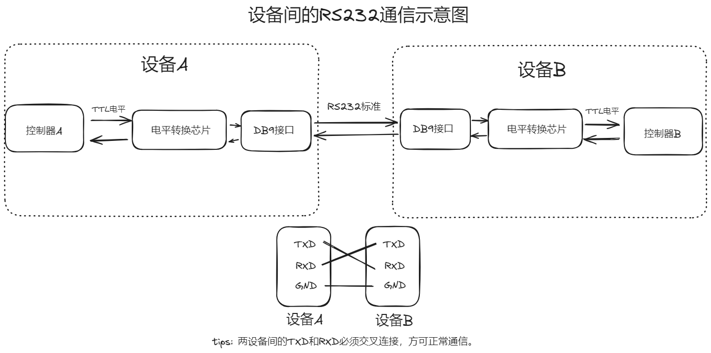
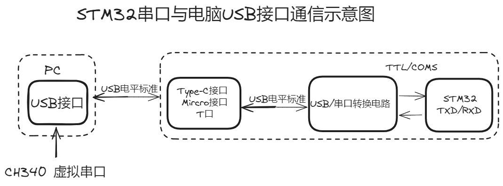
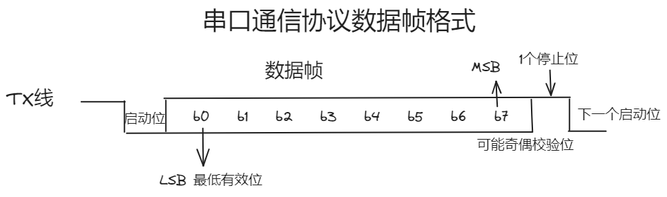
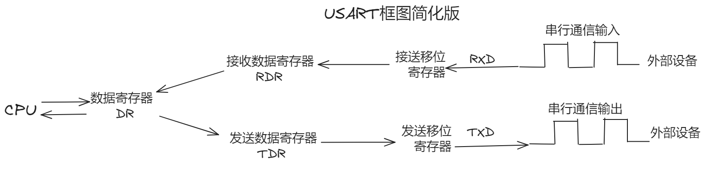
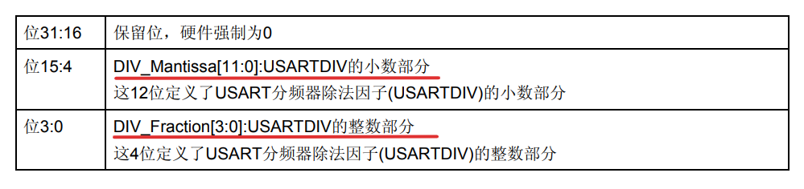
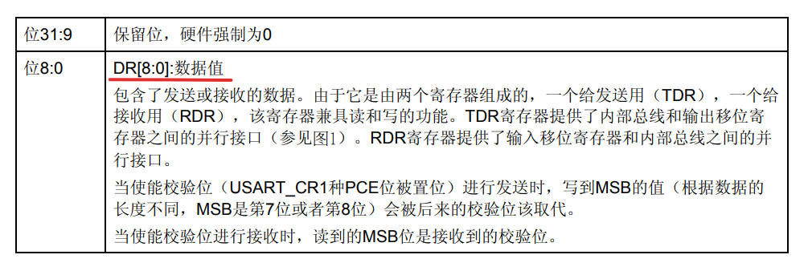
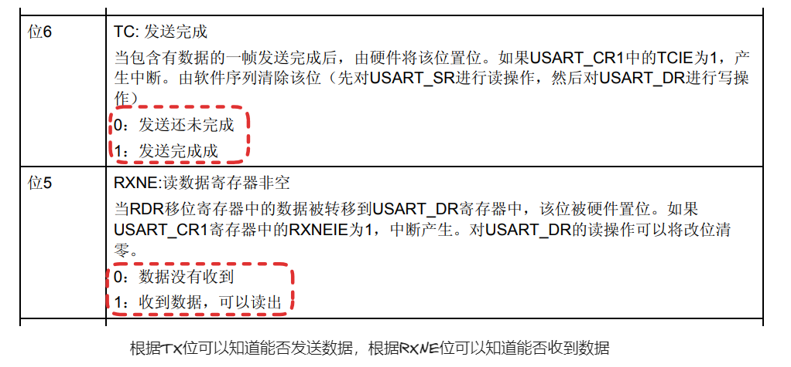
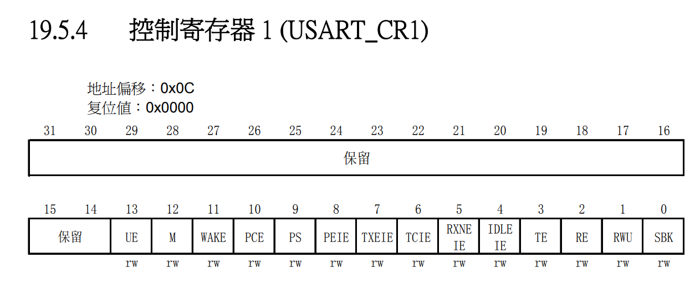
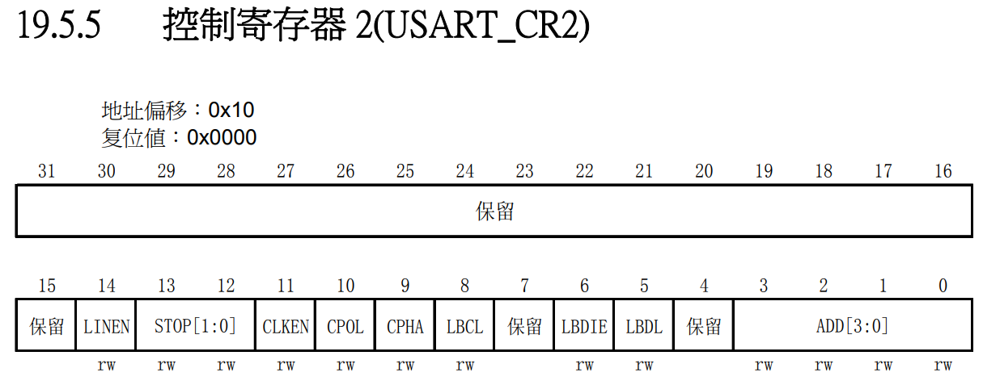
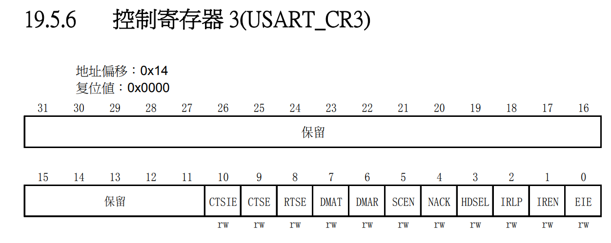

# 串口通信
串口通信是一种设备间常用的常用得到串行通信方式，串口按位发送和接收字节。
## STM32中常用的串口通信接口
|通信接口|接口引脚|数据同步方式|数据传输方向|
|:-----:|:------:|:---------:|:--------:|
|UART（通用异步收发器）|TXD：发送端 \| RXD：接收端 \| GND：公共地|异步通信|半双工|
|1-wire（单总线）|DQ：发送/接收端|异步通信|半双工|
|SPI|SCK：同步时钟 \| MISO：主机输入，从机输出 \| MOSI：主机输出，从机输入|同步通信|全双工|
|I2C|SCL：同步时钟 \| SDA：数据输入/输出端|同步通信|半双工|
## 串口通信协议
分为了**物理层**和**协议层**。     
### 物理层
**物理层**是指规定通讯系统中具有机械、电子功能部分的特性，确保原始数据在物理媒体的传输。  
**TTL、RS232和/COMS电平标准对比**  
|电平|逻辑1|逻辑0|
|:--:|:---:|:--:|
|RS232|-15V~-3V|+3V~+15V|
|COMS（STM常用）|3.3V|0|
|TTL（51常用）|5V|0V|

由上可知，TTL、COMS电平与RS232电平逻辑相反，所以COMS/TTL电平不能与RS232电平直接交换信息。若要进行通信，必须先进行转换。如图所示：     

### 协议层     
**协议层**是指规定了数据包的内容，内容包括了*起始位*、*主体数据*、*奇偶校验位*以及*停止位*，双方需要约定一致的数据包格式才能正常收发数据的有关规范。具体格式如图：
   
串口通信的数据包由发送设备的TXD接口传输到接收设备RXD接口。   
**启动位和停止位**：串口通信的一个数据帧是从启动位开始，直到停止位。启动为必须占一个位长，*保持逻辑0电平*。停止位必须有，*保持逻辑1电平*，可以占0.5、1、1.5、2个位长。  
**有效数据位**：低位（LSB）在前，高位在后（MSB）。可选5，6，7或8个位长。  
**校验位**：可选一个位长或者没有。  
## STM32F1串口
STM32F1 的串口分为两种：USART（即通用同步异步收发器）和 UART（即通用异步收发器）。  
UART 是在 USART 基础上裁剪掉了同步通信功能，只剩下异步通信功能。  
简单区分同步和异步就是看通信时需不需要*对外提供时钟输出*。  
平时用串口通信基本都是异步通信。
### USAET框图简化版

### USART波特率
**波特率计算公式**：$baud = fck / 16 * USARTDIV$。其中*fck*是串口的时钟，*USARTDIV*是一个无符号的定点数，并且允许有余数。

### USART寄存器
**USART_BRR**    

**USART_DR**   

**USART_SR**    
  
**USART_CR1**   
   
**USART_CR2**     

**USART_CR3**

## USART的HAL相关
#### HAL_StatusTypeDef HAL_UART_Init(UART_HandleTypeDef *huart);  
**函数描述**  
用于初始化异步模式的收发器。  
**函数形参**   
形参1是串口的句柄，结构体类型**UART_HandleTypeDef**，声明如下：   

    typedef struct
    {
        USART_TypeDef *Instance;        /* UART 寄存器基地址 */
        UART_InitTypeDef Init;          /* UART 通信参数 */
        uint8_t *pTxBuffPtr;            /* 指向 UART 发送缓冲区 */
        uint16_t TxXferSize;            /* UART 发送数据的大小 */
        __IO uint16_t TxXferCount;      /* UART 发送数据的个数 */
        uint8_t *pRxBuffPtr;            /* 指向 UART 接收缓冲区 */
        uint16_t RxXferSize;            /* UART 接收数据大小 */
        __IO uint16_t RxXferCount;      /* UART 接收数据的个数 */
        DMA_HandleTypeDef *hdmatx;      /* UART 发送参数设置（DMA） */
        DMA_HandleTypeDef *hdmarx;      /* UART 接收参数设置（DMA） */
        HAL_LockTypeDef Lock;           /* 锁定对象 */
        __IO HAL_UART_StateTypeDef gState; /* UART 发送状态结构体 */
        __IO HAL_UART_StateTypeDef RxState; /* UART 接收状态结构体 */
        __IO uint32_t ErrorCode;        /* UART 操作错误信息 */
    }UART_HandleTypeDef; 
其中成员2是UART初始化结构体，用于配置通讯参数如波特率、数据位数、停止位等等。   
结构体类型**UART_InitTypeDef**，声明如下：

    typedef struct
    {
        uint32_t BaudRate;          // 波特率
        uint32_t WordLength;        // 字长        
        uint32_t StopBits;          // 停止位        
        uint32_t Parity;            // 校验位        
        uint32_t Mode;              // UART模式       
        uint32_t HwFlowCtl;         // 硬件流设置        
        uint32_t OverSampling;      // 过采样设置     
    } UART_InitTypeDef;  
**函数返回值**   
该函数返回**HAL_StatusTypeDef**枚举类型的值，声明如下：

    typedef enum
    {
        HAL_OK       = 0x00U,
        HAL_ERROR    = 0x01U,
        HAL_BUSY     = 0x02U,
        HAL_TIMEOUT  = 0x03U
    } HAL_StatusTypeDef;   
#### HAL_StatusTypeDef HAL_UART_Receive_IT(UART_HandleTypeDef *huart, uint8_t *pData, uint16_t Size);
**函数描述**   
用于开启以中断的方式开启串口接收中断的函数。数据接收在中断处理函数里面体现。  
**函数形参**   
形参1是串口的句柄，结构体类型**UART_HandleTypeDef**。    
形参2是要接收的数据地址。   
形参3是要接受的数据大小，以字节为单位。   
**函数返回值**   
该函数返回**HAL_StatusTypeDef**枚举类型的值。   
#### void HAL_UART_IRQHandler(UART_HandleTypeDef *huart);
**函数描述**  
该函数位HAL库中断处理公共函数，在串口中断服务函数中被调用。   
**函数形参**  
形参1是串口的句柄，结构体类型**UART_HandleTypeDef**。  
**函数返回值**  
无  

## 串口配置步骤  
1.串口参数初始化  
2.使能串口和GPIO时钟  
3.GPIO模式设置  
4.开启串口相关中断，配置串口中断优先级   
5.编写中断服务函数  
6.串口数据接收和发送   
